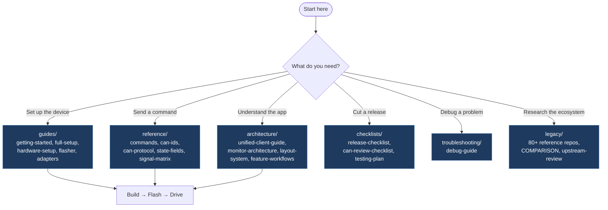

# Tesla CAN Modder Documentation

This folder is the canonical documentation source for the repo and the client docs screen. The app now renders these raw markdown files directly, so there is no separate generated docs bundle to keep in sync.

## Documentation Map

## Start Here

- [Getting Started](guides/getting-started.md)
- [Full Setup Guide](guides/full-setup.md)
- [Command Reference](reference/commands.md)
- [Unified Client Guide](architecture/unified-client-guide.md)
- [Release Checklist](checklists/release-checklist.md)

## Route Map

| Route                                                   | Start Page                                                   | Use It For                                                              |
| ------------------------------------------------------- | ------------------------------------------------------------ | ----------------------------------------------------------------------- |
| [`guides/`](guides/getting-started.md)                  | [Getting Started](guides/getting-started.md)                 | setup, flashing, hardware wiring, adapters, and first install flow      |
| [`reference/`](reference/commands.md)                   | [Command Reference](reference/commands.md)                   | commands, CAN IDs, state fields, APIs, protocol notes, and signal data  |
| [`architecture/`](architecture/unified-client-guide.md) | [Unified Client Guide](architecture/unified-client-guide.md) | client structure, monitor workflows, layout rules, and design decisions |
| [`checklists/`](checklists/release-checklist.md)        | [Release Checklist](checklists/release-checklist.md)         | release gates, QA, regression checks, and validation plans              |
| [`troubleshooting/`](troubleshooting/debug-guide.md)    | [Debug Guide](troubleshooting/debug-guide.md)                | runtime debugging, issue isolation, and integration troubleshooting     |
| [`legacy/`](legacy/README.md)                           | [Legacy Index](legacy/README.md)                             | community project archive and comparison material                       |

## Quick Routes

- First install: [Getting Started](guides/getting-started.md), [Quickstart Checklist](guides/quickstart-checklist.md), [Hardware Setup](guides/hardware-setup.md), [Flasher Quickstart](guides/flasher-quickstart.md)
- Connect and validate: [USB and Bluetooth Adapters](guides/adapters.md), [Full Setup Guide](guides/full-setup.md), [Security Model](guides/security.md)
- Firmware and protocol work: [Command Reference](reference/commands.md), [State Fields Reference](reference/state-fields.md), [CAN Protocol](reference/can-protocol.md), [Signal Matrix](reference/signal-matrix.md)
- Client and UX work: [Unified Client Guide](architecture/unified-client-guide.md), [Monitor Architecture](architecture/monitor-architecture.md), [Feature Workflows](architecture/feature-workflows.md), [Layout System](architecture/layout-system.md)
- Release and QA: [Quickstart Checklist](guides/quickstart-checklist.md), [E2E Testing Plan](checklists/testing-plan.md), [Release Checklist](checklists/release-checklist.md)
- Research and comparisons: [Legacy Index](legacy/README.md), [Legacy Comparison](legacy/COMPARISON.md)
