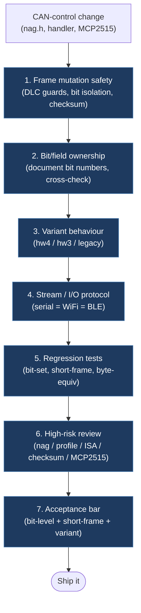

# CAN Control Review Checklist

Use this checklist whenever a change touches TeslaCANModder code that can alter CAN frame behavior.

Primary review scope:

- `firmware/lib/vehicle/can/feature/*` — feature handlers and frame mutation helpers (fsd, summon, climate, lock, etc.)
- `firmware/lib/vehicle/can/handler/*` — variant handlers (`hw3`, `hw4`, `legacy`) and dispatch logic
- `firmware/lib/core/driver/*` — MCP2515 driver, CAN bus init, frame TX/RX
- `firmware/lib/core/can/*` — shared CAN helpers, burst helpers, parsing, and low-level bit logic
- `firmware/lib/io/*` — serial, WiFi REST API, BLE (NimBLE) I/O layers

This checklist is meant for review and regression discipline. It is not a generic style guide.

## 1. Frame mutation safety

- Every direct `frame.data[...]` read has a matching DLC guard before access.
- Every direct `frame.data[...]` write has a matching DLC guard before mutation.
- Shared helpers still reject invalid bit indexes and writes outside the frame DLC.
- Bit writes only touch the intended field and do not leak into adjacent bits.
- Existing checksum logic is recalculated when a changed byte requires it.

## 2. Bit and field ownership

- The exact bit numbers changed by the patch are documented in the PR or commit notes.
- Changed bits were cross-checked against the active TeslaCANModder behavior, not only an old legacy sketch.
- If legacy references disagree, the reviewer notes which source is canonical for the active repo.
- Mux-specific behavior is preserved: a mux-only mutation must not leak into other mux paths.
- RX and TX ownership is still clear: the code only transmits frames on intended paths.

## 3. Variant behavior review

- `legacy`, `hw3`, and `hw4` were all considered, even if only one variant changed.
- Unsupported controls still remain unsupported on the wrong variant.
- `hw3` speed offset changes still preserve profile and nag behavior.
- `hw4` ISA speed-chime changes still preserve mux and checksum behavior.
- Legacy behavior was not changed accidentally by reusing HW3/HW4 helper logic.

## 4. Stream and I/O protocol review

- Any change to transmitted frames was checked against `firmware/lib/io/serial/usb/esp32/board.h`.
- If frame message shape changed, the client-side transport and parsing layers were reviewed at the same time.
- `boot` and `status` still describe capability changes accurately.
- Stream output still preserves `dir`, `id`, `dlc`, `d`, and any required metadata fields.
- WiFi REST API (`firmware/lib/io/wifi/esp32/board.h`) and BLE NUS (`firmware/lib/io/ble/esp32/board.h`) produce identical command semantics to serial.
- Changes to command routing were checked against `firmware/lib/vehicle/can/handler/*` and the serial/WiFi/BLE entry points.

## 5. Required regression tests

At least one of these must be added or updated when CAN-control behavior changes:

- exact bit-set / bit-clear assertion for the changed field
- short-frame regression test proving no send happens when DLC is too small
- variant-specific regression test proving unsupported variants do not drift
- stream/message-shape assertion when board output changes

Recommended existing suites:

- `firmware/test/test_native_helpers` — bit/frame helper assertions
- `firmware/test/test_native_hw3` — HW3 variant behavior
- `firmware/test/test_native_hw4` — HW4 variant behavior
- `firmware/test/test_native_legacy` — Legacy variant behavior
- `firmware/test/test_native_dispatch` — handler dispatch and routing
- `firmware/test/test_native_driver` — MCP2515 driver logic
- `firmware/test/test_native_serial` — serial command parsing
- `firmware/test/test_native_wifi` — WiFi REST API endpoints
- `firmware/test/test_native_persist` — EEPROM/NVS persistence

## 6. Manual reviewer questions

- Does this patch change which CAN IDs are intercepted or transmitted?
- Does this patch change any bit position, checksum, mux rule, or profile mapping?
- Does this patch add any path that can transmit when the feature is disabled?
- Does this patch change the browser-visible meaning of streamed frames or status?
- If this behavior came from a legacy sketch, is the old sketch actually the correct reference for the active repo?
- Does this patch affect bus routing (BUS_CHASSIS=0, BUS_VEHICLE=1, BUS_BODY=2)?
- Does this patch change behavior for any of the 3 MCP2515 buses on ESP32?
- Is the WiFi/BLE command path still consistent with the serial command path?

## 7. High-risk change types

Treat these as review-sensitive even if the diff looks small:

- helper changes in `firmware/lib/core/can/*` or any `firmware/lib/vehicle/can/feature/*` file
- mux / profile / offset / ISA-related changes in feature handlers such as `profile.h`, `offsets.h`, `isa_chime.h`, or `nag.h`
- checksum changes
- handler filter ID changes in `firmware/lib/vehicle/can/handler/*`
- stream message shape changes
- serial / WiFi / BLE command entry changes that affect CAN mutation state
- MCP2515 driver changes in `firmware/lib/core/driver/`
- bus routing changes (BUS_CHASSIS / BUS_VEHICLE / BUS_BODY assignments)
- WiFi/BLE endpoint changes that expose new CAN mutation paths

## 8. Minimum acceptance bar

A CAN-control change is not complete until:

- the intended bit-level behavior is asserted in tests
- short-frame behavior is asserted where relevant
- the active variant behavior is still explicit
- the reviewer can explain exactly which CAN IDs and bits changed
