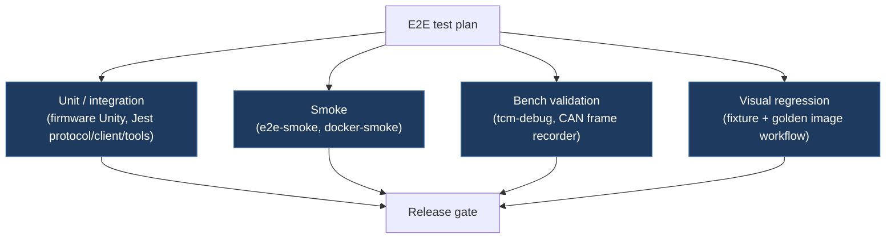

---
title: E2E Testing Plan
title_tr: E2E Test Planı
description: Board-specific end-to-end scenarios, runtime validation, and visual regression coverage
category: checklists
folder: checklists
tags: [e2e, testing, plan, visual]
order: 15
icon: 🧪
---

# End-to-End User Scenarios & Test Plan



Board-specific test scenarios for every supported hardware configuration. Each scenario documents exact wiring, firmware environment, connectivity, and feature coverage.

---

## Board Reference

| Board        | CAN Modules   | CAN Buses                                  | Connectivity                          | Persistence       | Firmware Envs                                                                           |
| ------------ | ------------- | ------------------------------------------ | ------------------------------------- | ----------------- | --------------------------------------------------------------------------------------- |
| ESP32 DevKit | MCP2515 × 1–3 | BUS_CHASSIS, BUS_VEHICLE, BUS_BODY (flags) | USB Serial, WiFi AP/STA, BLE (NimBLE) | NVS (Preferences) | `esp32[_wifi][_ble][_chassis][_vehicle][_body][_8mhz\|_16mhz]` envs in `platformio.ini` |

---

## ESP32 Scenarios

## ESP32-1: First-Time Setup — Chassis Bus Only (esp32_chassis_8mhz)

**User Story:** New user wires ESP32 DevKit + 1× MCP2515, connects via USB serial.

**Hardware:** ESP32 DevKit, MCP2515 (8 MHz crystal), USB cable

**Wiring:**

| MCP2515 Pin | ESP32 Pin                   | Function                        |
| ----------- | --------------------------- | ------------------------------- |
| VCC         | 5V (VIN)                    | Power (MCP2515 needs 5V)        |
| GND         | GND                         | Ground                          |
| CS          | GPIO 15 (PIN_MCP2515_1_CS)  | SPI chip select                 |
| INT         | GPIO 34 (PIN_MCP2515_1_INT) | Hardware interrupt (input-only) |
| SCK         | GPIO 18 (PIN_SPI_SCK)       | SPI clock                       |
| MOSI        | GPIO 23 (PIN_SPI_MOSI)      | SPI MOSI                        |
| MISO        | GPIO 19 (PIN_SPI_MISO)      | SPI MISO                        |
| CAN-H       | X179 pin 13                 | Chassis CAN high                |
| CAN-L       | X179 pin 14                 | Chassis CAN low                 |

| Step | Action                                             | Expected Result                                                                                                                                                                | Status |
| ---- | -------------------------------------------------- | ------------------------------------------------------------------------------------------------------------------------------------------------------------------------------ | ------ |
| 1    | Wire MCP2515 to ESP32 per table                    | Physical wiring complete                                                                                                                                                       | —      |
| 2    | Flash `esp32_chassis_8mhz` via PlatformIO (COM4)   | Upload successful                                                                                                                                                              | —      |
| 3    | Open serial monitor at 115200                      | Boot JSON received                                                                                                                                                             | —      |
| 4    | Verify boot                                        | `{"t":"boot","hw":"ESP32S_DevKit","can":"MCP2515_1x","drv":"arduino-mcp2515","busChassis":true,"busVehicle":false,"busBody":false,"wifiEnabled":false,"bleEnabled":false,...}` | —      |
| 5    | Connect browser client via USB                     | Web Serial connects to ESP32                                                                                                                                                   | —      |
| 6    | MCP2515 init uses configured `BOARD_CAN_CLOCK_MHZ` | Crystal frequency must match the build env (`_8mhz` or `_16mhz`)                                                                                                               | —      |

**Pass Criteria:** ESP32 running chassis bus only, USB serial functional, no WiFi/BLE.

---

## ESP32-2: Full Bus Setup with X179 (esp32_chassis_vehicle_body_8mhz)

**User Story:** User wires all 3× MCP2515 modules for full Tesla X179 connector coverage.

**X179 + AP Connector Bus Mapping (config/esp32.h):**

| Bus Index       | MCP2515 # | Connector       | CAN Bus Function    | CS GPIO | INT GPIO |
| --------------- | --------- | --------------- | ------------------- | ------- | -------- |
| 0 (BUS_CHASSIS) | #1        | X179 pins 13-14 | Chassis / Autopilot | 15      | 34       |
| 1 (BUS_VEHICLE) | #2        | X179 pins 9-10  | Vehicle Control     | 27      | 35       |
| 2 (BUS_BODY)    | #3        | X179 pins 2-3   | Body Control        | 26      | 33       |

**All MCP2515s share SPI:** SCK=18, MOSI=23, MISO=19. **VCC = 5V (VIN)** on every module.

| Step | Action                                    | Expected Result                                                       |
| ---- | ----------------------------------------- | --------------------------------------------------------------------- |
| 1    | Wire 3 MCP2515 modules per table          | All modules sharing SPI bus, each on its own CS/INT                   |
| 2    | Flash `esp32_chassis_vehicle_body_8mhz`   | Boot shows `busChassis:true, busVehicle:true, busBody:true`           |
| 3    | Bus 0 (Chassis) receives autopilot frames | 0x399, 0x3FD, 0x3F8                                                   |
| 4    | Bus 1 (Vehicle) receives control frames   | 0x273, 0x2F3, 0x333, 0x334                                            |
| 5    | Bus 2 (Body) receives body frames         | 0x119 (window/vent), 0x284 (sentry), trunk ctrl                       |
| 7    | All buses use hardware interrupts         | ESP32 supports INT on GPIO 34, 35, 33, 39                             |
| 8    | DAS / FSD mods applied on Bus 0           | Handler dispatches by bus index; DAS injection always targets Chassis |
| 9    | Vehicle commands sent on Bus 1            | Climate, charge, drive routed correctly                               |
| 10   | Body commands sent on Bus 2               | Window, sentry, trunk routed correctly                                |
| 11   | One bus init fails                        | Remaining buses still operate                                         |

**ESP32 dispatch:** ESP32 routes by bus index (`handleMessage` checks `bus` parameter) and uses hardware interrupts on every bus.

---

## ESP32-3: WiFi AP + Dashboard (esp32_wifi)

**User Story:** User enables WiFi AP for wireless dashboard access.

**Firmware:** `esp32_wifi_chassis_8mhz` — WiFi ON, BLE OFF

| Step | Action                                              | Expected Result                                 | Status |
| ---- | --------------------------------------------------- | ----------------------------------------------- | ------ |
| 1    | Flash `esp32_wifi_chassis_8mhz` firmware            | Upload with `embed_html.py` pre-build           | —      |
| 2    | ESP32 creates AP "TeslaCANModder"                   | SSID visible on phone/laptop                    | —      |
| 3    | Connect to AP (password: `T3SL@c@n123.`, channel 6) | DHCP assigns IP (gateway: 192.168.4.1)          | —      |
| 4    | Open <http://192.168.4.1>                           | Embedded HTML dashboard loads                   | —      |
| 5    | Dashboard shows system status cards                 | Hardware, CAN stats, WiFi status, settings      | —      |
| 6    | Send command via dashboard button                   | POST `/api/command` → ACK                       | —      |
| 7    | Check WiFi status card                              | Mode: AP, IP: 192.168.4.1, SSID: TeslaCANModder | —      |
| 8    | USB serial still works simultaneously               | Both channels independent                       | —      |

**WiFi REST API Endpoints:**

| Method | Path               | Purpose                                                                     |
| ------ | ------------------ | --------------------------------------------------------------------------- |
| GET    | `/`                | HTML dashboard (PROGMEM)                                                    |
| GET    | `/api/ping`        | `{"t":"pong","v":1}`                                                        |
| GET    | `/api/status`      | Full state JSON (variant, FSD, nag, profile, features, hardware, CAN stats) |
| POST   | `/api/command`     | Execute command: `{"cmd":"fsd:on"}` → returns updated status                |
| GET    | `/api/disable`     | Emergency kill: FSD off, summon stop                                        |
| GET    | `/api/wifi/status` | WiFi mode, SSID, IP, RSSI/clients, gateway, MAC                             |
| POST   | `/api/wifi/config` | Switch WiFi mode: `{"mode":"ap"\|"sta","ssid":"...","password":"..."}`      |

**All endpoints return CORS headers** (`Access-Control-Allow-Origin: *`) with OPTIONS preflight support.

---

## ESP32-4: WiFi AP → STA Mode Switching

**User Story:** User switches from AP mode to home STA network for remote access.

| Step | Action                                                                               | Expected Result                            |
| ---- | ------------------------------------------------------------------------------------ | ------------------------------------------ |
| 1    | Start in AP mode (default)                                                           | 192.168.4.1 accessible                     |
| 2    | POST `/api/wifi/config` with `{"mode":"sta","ssid":"HomeWiFi","password":"pass123"}` | Board disconnects AP                       |
| 3    | ESP32 connects to home router                                                        | STA mode, new IP from router DHCP          |
| 4    | STA connection timeout = 15s                                                         | Falls back to AP on failure                |
| 5    | Access dashboard at new IP                                                           | Same dashboard on home network             |
| 6    | POST `/api/wifi/config` with `{"mode":"ap"}`                                         | Board creates AP again                     |
| 7    | WiFi config persists in NVS                                                          | `tcm_wifi` namespace: mode, SSID, password |
| 8    | Power cycle                                                                          | Board boots in saved WiFi mode             |

---

## ESP32-5: BLE Connection (esp32_ble)

**User Story:** User connects to ESP32 via BLE for wireless serial-like access. BLE works with iOS and Android.

**Firmware:** `esp32_ble_chassis_8mhz` — BLE ON, WiFi OFF

**BLE Service:** Nordic UART Service (NUS)

| UUID                                   | Direction               | Purpose               |
| -------------------------------------- | ----------------------- | --------------------- |
| `6E400001-B5A3-F393-E0A9-E50E24DCCA9E` | —                       | Service UUID          |
| `6E400002-B5A3-F393-E0A9-E50E24DCCA9E` | Write (phone → device)  | RX: Send commands     |
| `6E400003-B5A3-F393-E0A9-E50E24DCCA9E` | Notify (device → phone) | TX: Receive responses |

| Step | Action                                                 | Expected Result                            | Status |
| ---- | ------------------------------------------------------ | ------------------------------------------ | ------ |
| 1    | Flash `esp32_ble_chassis_8mhz` firmware                | Boot shows BLE capability                  | —      |
| 2    | Open BLE scanner (nRF Connect, LightBlue)              | "TeslaCANModder" device visible            | —      |
| 3    | Connect to device                                      | BLE connection established                 | —      |
| 4    | Subscribe to TX characteristic (6E400003)              | Status notifications arrive                | —      |
| 5    | Write `{"cmd":"ping"}` to RX characteristic (6E400002) | `{"t":"pong","v":1}` notified back         | —      |
| 6    | Write `{"cmd":"fsd:on"}`                               | ACK notification, FSD enabled              | —      |
| 7    | BLE and USB serial simultaneous                        | Both channels work independently           | —      |
| 8    | Disconnect BLE                                         | Board continues, auto-restarts advertising | —      |
| 9    | Reconnect BLE                                          | Resume receiving notifications             | —      |

**BLE Notes:**

| Feature         | ESP32 BLE (NimBLE)   |
| --------------- | -------------------- |
| Protocol        | BLE GATT (NUS)       |
| iOS support     | ✓                    |
| Android support | ✓                    |
| Encryption      | BLE pairing          |
| Range           | ~30m                 |
| Power           | Low power            |
| Buffer          | 256-byte ring buffer |
| Runtime toggle  | Yes (via WiFi API)   |
| TX power        | ESP_PWR_LVL_P9       |

---

## ESP32-6: WiFi + BLE Combined (esp32_wifi_ble)

**User Story:** Full-featured ESP32 with all 3 connectivity options: USB Serial + WiFi + BLE.

**Firmware:** `esp32_wifi_ble_chassis_vehicle_body_8mhz` — WiFi ON, BLE ON, full X179 buses

| Step | Action                                           | Expected Result                                                                       |
| ---- | ------------------------------------------------ | ------------------------------------------------------------------------------------- |
| 1    | Flash `esp32_wifi_ble_chassis_vehicle_body_8mhz` | Boot shows WiFi + BLE + active buses                                                  |
| 2    | WiFi AP active                                   | "TeslaCANModder" AP visible                                                           |
| 3    | BLE advertising                                  | "TeslaCANModder" in BLE scanner                                                       |
| 4    | USB serial active                                | 115200 baud, boot JSON received                                                       |
| 5    | All 3 channels accept commands                   | Same command set, same responses                                                      |
| 6    | Command from WiFi affects BLE status             | State is shared across all channels                                                   |
| 7    | Toggle BLE off via WiFi dashboard                | BLE stops advertising, disconnects                                                    |
| 8    | GET `/api/status`                                | `ble` sub-object: `{"enabled":false,"connected":false,"deviceName":"TeslaCANModder"}` |
| 9    | POST `/api/command` `{"cmd":"ble:on"}`           | BLE restarts, device visible again                                                    |
| 10   | POST `/api/command` `{"cmd":"ble:name:NewName"}` | BLE re-advertises with new name; persists in NVS                                      |
| 11   | BLE state persists in NVS                        | `tcm_ble` namespace                                                                   |

**BLE wire commands (any transport — USB, BLE NUS, or `POST /api/command`):**

| Command        | Purpose                                                                |
| -------------- | ---------------------------------------------------------------------- |
| `ble:on`       | Start BLE radio; persist enabled flag to NVS                           |
| `ble:off`      | Stop BLE radio; persist disabled flag to NVS                           |
| `ble:name:<n>` | Update advertised device name (1–32 chars); persist to NVS             |
| `ble:status`   | Emit `{"t":"ble","enabled":...,"connected":...,"deviceName":...}` line |

> Per-feature `/api/ble/*` REST routes have been removed. All BLE control now
> flows through the unified `/api/command` dispatcher and the aggregated
> `/api/status` snapshot — see [`docs/reference/wifi-api.md`](../reference/wifi-api.md).

---

## ESP32-7: FSD + Nag Configuration

**User Story:** Configure FSD/nag features through any of USB, WiFi, or BLE.

| Step | Action (any channel) | Expected Result            |
| ---- | -------------------- | -------------------------- |
| 1    | `fsd:on`             | ACK, FSD enabled           |
| 2    | `nag:mode:bit19`     | ACK, nag suppression ON    |
| 3    | `profile:2`          | Profile pinned to 2        |
| 4    | `profile:auto`       | Profile follows stalk      |
| 5    | (HW4) `isa-chime:on` | ISA chime suppressed       |
| 6    | (HW3) `offset:60`    | Speed offset 60%           |
| 7    | `status`             | All settings in JSON       |
| 8    | Power cycle          | Settings restored from NVS |

**NVS Persistence:** Namespace `tcm`, magic `0xCA`, version `0x0E`. Keys: `variant`, `fsd`, `nag`, `sp`, `spPin`, `offset`, `offPin`, `isa`.

---

## ESP32-8: Vehicle Controls

Vehicle commands require `BUS_VEHICLE_ACTIVE=1` and/or `BUS_BODY_ACTIVE=1` for vehicle/window/sentry/climate/charge/drive commands to be compiled in.

| Step | Action                                                  | Expected Result                                                |
| ---- | ------------------------------------------------------- | -------------------------------------------------------------- |
| 1    | Wait for frame caches to populate                       | `hasCtrl`, `hasClimate`, `hasCharge`, `hasDrive` from live CAN |
| 2    | `unlock` via WiFi dashboard                             | 30× 0x273 burst on Bus 1 (Vehicle)                             |
| 3    | `frunk:open`                                            | 50× 0x273 burst                                                |
| 4    | `climate:keep`                                          | 0x2F3 modified, sent on Bus 1                                  |
| 5    | `vent:open`                                             | 0x119 sent on Bus 2 (Body)                                     |
| 6    | `sentry:on`                                             | 0x284 sent on Bus 2 (Body)                                     |
| 7    | `pedal:sport`                                           | 0x334 modified, sent on Bus 1                                  |
| 8    | Send command on a chassis-only firmware (no `_vehicle`) | Vehicle commands not available (not compiled)                  |

**ESP32 Bus Routing:**

| Command Group                     | Target Bus      | CAN ID              |
| --------------------------------- | --------------- | ------------------- |
| FSD, nag, profile, ISA            | Bus 0 (FSD)     | 0x399 (intercepted) |
| lock, unlock, mirror, seat, power | Bus 1 (Vehicle) | 0x273               |
| climate                           | Bus 1 (Vehicle) | 0x2F3               |
| charge                            | Bus 1 (Vehicle) | 0x333               |
| drive, pedal, regen               | Bus 1 (Vehicle) | 0x334               |
| window vent                       | Bus 2 (Body)    | 0x119               |
| sentry                            | Bus 2 (Body)    | 0x284               |
| trunk, frunk                      | Bus 2 (Body)    | trunk ctrl ID       |

---

## ESP32-9: Summon

Summon only functions when `BUS_VEHICLE_ACTIVE=1`. Burst frames sent on Bus 1 (Vehicle) using cached 0x273.

---

## ESP32-10: CAN Stream & Debugging

| Step | Action                          | Expected Result                          |
| ---- | ------------------------------- | ---------------------------------------- |
| 1    | `stream:on` (via any channel)   | CAN frames streamed as JSON              |
| 2    | Frames show bus index (0, 1, 2) | All 3 buses visible                      |
| 3    | `can:raw:on`                    | All buses pass-through (filters cleared) |
| 4    | `can:raw:off`                   | Per-bus filters re-applied               |
| 5    | WiFi command while streaming    | No delay on frame processing             |

---

## ESP32-11: Powerbank Deployment

| Step | Action                       | Expected Result                     |
| ---- | ---------------------------- | ----------------------------------- |
| 1    | Configure via WiFi dashboard | Settings saved to NVS               |
| 2    | Disconnect laptop            | Board still powered                 |
| 3    | Connect powerbank            | Board reboots, loads NVS settings   |
| 4    | Place in car                 | Board running standalone            |
| 5    | Drive — CAN frames flow      | All mods active                     |
| 6    | Park, walk away              | CAN bus silent, standby after 10s   |
| 7    | WiFi AP still active         | Can reconnect phone to check status |
| 8    | BLE still advertising        | Can connect phone BLE to check      |
| 9    | Return, open door            | CAN wakes, auto-recovery            |
| 10   | All mods resume              | No user interaction needed          |

---

## ESP32-12: Power Cycle Recovery

| Step | Action                 | Expected Result                                     |
| ---- | ---------------------- | --------------------------------------------------- |
| 1    | Board running normally | All features active                                 |
| 2    | Power loss (2 seconds) | Board shuts down                                    |
| 3    | Power restored         | Board reboots                                       |
| 4    | NVS settings restored  | FSD/Nag/Profile match pre-disconnect                |
| 5    | WiFi AP restarts       | Dashboard accessible at 192.168.4.1                 |
| 6    | BLE re-advertises      | Device visible in scanner                           |
| 7    | CAN frames resume      | Mods applied immediately                            |
| 8    | Frame caches rebuild   | hasCtrl/hasClimate/hasCharge/hasDrive from live CAN |

---

## ESP32-13: Error Handling

| Case  | Trigger                                                     | Expected Result                                     |
| ----- | ----------------------------------------------------------- | --------------------------------------------------- |
| 13.1  | Send command without CAN init                               | Error response                                      |
| 13.2  | Vehicle cmd without 0x273 cache                             | Error: "Waiting for 0x273 frame"                    |
| 13.3  | Climate cmd without 0x2F3 cache                             | Error: "Need 0x2F3"                                 |
| 13.4  | Unknown command                                             | Error: "Unknown command"                            |
| 13.5  | WiFi client during active CAN                               | No frame processing delay                           |
| 13.6  | BLE and WiFi both active                                    | All 3 I/O paths work simultaneously                 |
| 13.7  | WiFi AP→STA switch fails (timeout 15s)                      | Falls back to AP mode                               |
| 13.8  | NVS corrupted/empty                                         | Factory defaults applied                            |
| 13.9  | MCP2515 crystal mismatch                                    | Init tries 8MHz then 16MHz                          |
| 13.10 | Chassis-only firmware (no `_vehicle`), vehicle command sent | Command not available (not compiled)                |
| 13.11 | BLE toggle off via REST, reconnect attempt                  | Device not found in scanner                         |
| 13.12 | Command > 31 chars                                          | Buffer overflow rejected                            |
| 13.13 | Invalid chars in REST command body                          | Same validation as serial (a-z, A-Z, 0-9, :, -, \_) |
| 13.14 | CORS preflight request                                      | OPTIONS returns proper headers                      |

---

## ESP32-14: Drive Context Validation (D-05, D-11, D-13)

**User Story:** Validate live driving-context overlays after firmware/protocol wiring for turn signals, blind-spot levels, door/frunk/trunk state, and cruise/speed-limit context.

**Firmware:** any `esp32_*chassis*` env (e.g. `esp32_chassis_8mhz`, `esp32_wifi_chassis_8mhz`, `esp32_wifi_ble_chassis_vehicle_body_8mhz`) flashed with live vehicle CAN

**Prerequisites:**

- Vehicle connected and transmitting on required buses
- Monitor or serial stream visible (`status` and optional `stream:on`)
- Drive view open in unified client
- Safety observer present for on-road scenarios

### Optional Evidence Automation (CLI)

Use the tools command to capture a synchronized status report while running the scenario matrix:

```bash
node tools/debug.js drive-context --port COM5 --drive-duration 45000 --drive-output artifacts/drive-context-report.json
```

If using the package binary:

```bash
tcm-debug drive-context --port COM5 --drive-duration 45000 --drive-output artifacts/drive-context-report.json
```

The report includes latest field snapshot, observed activity coverage for D-05/D-11/D-13, basic consistency checks, and `closureReadiness` gates (`d05`, `d11`, `d13`, `allReady`) to drive closure tracking.

Use `closureChecklist.missingScenarioIds` from the report to select the next targeted scenario run until strict mode returns `allReady=true`.

For closure runs, use strict mode so command exit code reflects readiness:

```bash
node tools/debug.js drive-context --port COM5 --drive-duration 60000 --drive-min-samples 10 --drive-expect-full --drive-output artifacts/drive-context-report.json
```

### Signal Source Reference

| Feature              | Signal(s)                                                                                                                                     | Primary CAN source                                  |
| -------------------- | --------------------------------------------------------------------------------------------------------------------------------------------- | --------------------------------------------------- |
| D-05 turn indicators | `turnSignalLeft`, `turnSignalRight`                                                                                                           | VCFRONT turn status frame (0x3F5)                   |
| D-05 blind-spot      | `bsmLeftLevel`, `bsmRightLevel`                                                                                                               | DAS blind-spot frame (0x399)                        |
| D-11 open state      | `doorFrontLeftOpen`, `doorFrontRightOpen`, `doorRearLeftOpen`, `doorRearRightOpen`, `driverDoorOpen`, `anyDoorOpen`, `frunkOpen`, `trunkOpen` | VCLEFT/VCRIGHT/VCFRONT door-latch and status frames |
| D-13 cruise/limit    | `cruiseSetSpeedKph`, `accSpeedLimitKph`, `mapSpeedLimitKph`, `maxSpeedKph`                                                                    | DAS/UI speed context frames (0x2B9, 0x389, 0x3D9)   |

### Scenario Matrix

| ID    | Action                                      | Expected board/protocol state                | Expected Drive UI                                  |
| ----- | ------------------------------------------- | -------------------------------------------- | -------------------------------------------------- |
| 14.1  | Activate left indicator                     | `turnSignalLeft:true`, right false           | Left warning badge active, right muted             |
| 14.2  | Activate right indicator                    | `turnSignalRight:true`, left false           | Right warning badge active, left muted             |
| 14.3  | Hazard lights on                            | both turn signals true                       | Both warning badges active                         |
| 14.4  | Blind-spot object enters left warning zone  | `bsmLeftLevel` rises (1 or 2)                | Left BSM badge escalates (`BSM L`/`BSM L!`)        |
| 14.5  | Blind-spot object enters right warning zone | `bsmRightLevel` rises (1 or 2)               | Right BSM badge escalates (`BSM R`/`BSM R!`)       |
| 14.6  | Open driver door                            | `driverDoorOpen:true`, `anyDoorOpen:true`    | Open-state band shows `OPEN` and includes `Driver` |
| 14.7  | Open each passenger door one-by-one         | Corresponding door flags true                | Open-state text includes matching door labels      |
| 14.8  | Open frunk                                  | `frunkOpen:true`                             | Open-state text includes `Frunk`                   |
| 14.9  | Open trunk                                  | `trunkOpen:true`                             | Open-state text includes `Trunk`                   |
| 14.10 | Close all openings                          | all door/frunk/trunk flags false             | Open-state band shows `CLOSED` and all-closed copy |
| 14.11 | Engage cruise / set target                  | `cruiseSetSpeedKph > 0`                      | Cruise badge shows numeric kph value               |
| 14.12 | Change max/AP speed                         | `maxSpeedKph` changes                        | Max badge updates numeric value                    |
| 14.13 | Map/ACC speed-limit context appears         | `mapSpeedLimitKph` or `accSpeedLimitKph` > 0 | Limit badge updates from `--` to numeric kph       |
| 14.14 | Context unavailable                         | all three speed context values are 0         | Cruise/Max/Limit badges show `--`                  |

### Evidence Capture Template

Record each scenario with synchronized evidence:

| Scenario ID | Timestamp           | Vehicle state note   | Status payload excerpt        | UI screenshot/video ref        | Pass/Fail | Notes                     |
| ----------- | ------------------- | -------------------- | ----------------------------- | ------------------------------ | --------- | ------------------------- |
| 14.x        | YYYY-MM-DD HH:MM:SS | brief action context | include changed keys + values | file/link in test artifact set | pass/fail | mismatch or edge behavior |

### Acceptance Criteria for Closure

- D-05 closure: scenarios 14.1 through 14.5 pass with evidence
- D-11 closure: scenarios 14.6 through 14.10 pass with evidence
- D-13 closure: scenarios 14.11 through 14.14 pass with evidence
- Evidence archived in release artifacts and summarized in the validation notes

---

## Cross-Board Scenarios

## CROSS-1: Variant Behavior Consistency

**Same variant behavior on both boards:**

| Feature            | HW4            | HW3            | Legacy   |
| ------------------ | -------------- | -------------- | -------- |
| FSD enable/disable | ✓              | ✓              | ✓        |
| Nag suppression    | ✓              | ✓              | ✓        |
| Speed profile      | Auto/Pin (0-3) | Auto/Pin (0-3) | 0-2 only |
| Speed offset       | —              | ✓ (0-100%)     | —        |
| ISA chime suppress | ✓              | —              | —        |
| Summon             | ✓              | ✓              | —        |

**Handler dispatch:**

- ESP32: `handleMessage` routes by bus index (Bus 0=FSD, Bus 1=Vehicle, Bus 2=Body)

---

## CROSS-2: Command Parity

All commands work identically across all I/O channels:

| Channel        | Board            | Baud/Protocol         | Simultaneous          |
| -------------- | ---------------- | --------------------- | --------------------- |
| USB Serial     | ESP32            | 115200 baud, JSON     | Always                |
| BLE (NimBLE)   | ESP32 (`*_ble`)  | BLE NUS packets, JSON | Yes (with USB + WiFi) |
| WiFi REST      | ESP32 (`*_wifi`) | HTTP REST, JSON       | Yes (with USB + BLE)  |
| WiFi Dashboard | ESP32 (`*_wifi`) | HTML UI → REST        | Yes (with all)        |

**Full Command Reference:**

| Command                                                      | Domain    | Cached Frame Required    |
| ------------------------------------------------------------ | --------- | ------------------------ |
| `ping`                                                       | System    | —                        |
| `status`                                                     | System    | —                        |
| `stream:on` / `stream:off`                                   | System    | —                        |
| `can:raw:on` / `can:raw:off`                                 | System    | —                        |
| `fsd:on` / `fsd:off`                                         | FSD       | —                        |
| `nag:mode:bit19` / `nag:mode:off`                            | FSD       | —                        |
| `profile:0-3` / `profile:auto`                               | FSD       | —                        |
| `offset:0-100` / `offset:auto`                               | FSD (HW3) | —                        |
| `isa-chime:on` / `isa-chime:off`                             | FSD (HW4) | —                        |
| `summon:forward` / `summon:reverse` / `summon:stop`          | Summon    | `hasCtrl` (0x273)        |
| `variant:hw4` / `variant:hw3` / `variant:legacy`             | System    | —                        |
| `lock` / `unlock` / `lock:child`                             | Vehicle   | `hasCtrl` (0x273)        |
| `frunk:open` / `frunk:close` / `frunk`                       | Trunk     | `hasCtrl` (0x273)        |
| `trunk:open` / `trunk:close` / `trunk`                       | Trunk     | `hasCtrl` (0x273)        |
| `mirror:fold` / `mirror:unfold` / `mirror:heat`              | Mirror    | `hasCtrl` (0x273)        |
| `light:fog:front` / `light:fog:rear` / `light:highbeam:auto` | Light     | `hasCtrl` (0x273)        |
| `wiper:off` / `wiper:1` / `wiper:2`                          | Wiper     | `hasCtrl` (0x273)        |
| `seat:fl:0-3` / `seat:fr:0-3`                                | Seat      | `hasCtrl` (0x273)        |
| `maindisplay:<0-127>`                                        | Display   | `hasCtrl` (0x273)        |
| `power`                                                      | Power     | `hasCtrl` (0x273)        |
| `window:vent:open` / `window:vent:close`                     | Window    | — (`_body` env required) |
| `sentry:on` / `sentry:off`                                   | Sentry    | — (`_body` env required) |
| `climate:keep` / `climate:off`                               | Climate   | `hasClimate` (0x2F3)     |
| `charge:start` / `charge:stop` / `charge:port`               | Charge    | `hasCharge` (0x333)      |
| `pedal:sport` / `pedal:chill` / `pedal:std`                  | Drive     | `hasDrive` (0x334)       |

---

## CROSS-3: Persistence Parity

| Field            | ESP32 (NVS)                                 |
| ---------------- | ------------------------------------------- |
| Magic            | `magic` key = 0xCA                          |
| Version          | `ver` key = 0x0E                            |
| Variant          | `variant` key                               |
| FSD enabled      | `fsd` key                                   |
| Nag suppress     | `nag` key                                   |
| Speed profile    | `sp` key                                    |
| Profile override | `spPin` key                                 |
| Speed offset     | `offset` key                                |
| Offset override  | `offPin` key                                |
| ISA chime        | `isa` key                                   |
| WiFi config      | `tcm_wifi` namespace (mode, SSID, password) |
| BLE config       | `tcm_ble` namespace (enabled)               |

---

## CROSS-4: CAN Health & Standby

CAN health monitoring constants:

| Constant               | Value     | Purpose                       |
| ---------------------- | --------- | ----------------------------- |
| `CAN_TIMEOUT_MS`       | 10,000 ms | No frames → enter standby     |
| `CAN_REINIT_INTERVAL`  | 5,000 ms  | Retry MCP2515 init in standby |
| `LED_STANDBY_INTERVAL` | 2,000 ms  | LED slow-blink in standby     |

**Standby behavior:** MCP2515 listen-only, reduced polling, LED slow-blink. Auto-recovery when CAN traffic resumes.

---

## CROSS-5: MCP2515 Hardware Filter Mapping

ESP32 uses MCP2515 hardware filters (RXF0-5, MASK0/MASK1) set per variant and per bus.

| Bus      | ESP32 Filter Source                                         |
| -------- | ----------------------------------------------------------- |
| 0        | Variant FSD IDs (0x399, etc.) — FSD bus only                |
| 1        | Vehicle IDs (0x273, 0x2F3, 0x333, 0x334) — Vehicle bus only |
| 2        | (if `_body` env) Body IDs — Body bus only                   |
| Raw mode | All filters cleared                                         |

`applyFilters(State&)` is called on variant change, raw mode toggle, and CAN reinit.

---

## UI-1: Visual Regression Coverage

Use this section when a release changes `client/` presentation in a way that should preserve a visible baseline for Drive, Controls, or Monitor screens.

### Decision

- Keep visual regression coverage in the main testing plan.
- Do not treat it as a blocking release gate yet.
- Promote it to a required gate only after the repo has a committed visual fixture set and approved baseline images.

### Current Status

- `client/src/screens/DriveScreen.tsx` and `client/src/AppExperience.tsx` are valid UI targets.
- There is currently no committed `docs/golden-images/` directory in the repo.
- There is currently no dedicated visual-fixture pack for deterministic screenshot states.

### Implementation Plan

1. Add a deterministic visual fixture source for Drive, Controls, and Monitor states under the client test/dev tooling.
2. Create a committed baseline image directory, such as `docs/golden-images/`, and document ownership for updates.
3. Add a repeatable capture flow for `phone`, `tablet`, and `desktop` breakpoints in both themes.
4. Capture and approve the initial golden set for the highest-value scenarios first: idle, driving, autopilot, controls pending/error, and monitor diff highlighting.
5. Once the fixture + baseline workflow exists, make visual regression a required release gate for UI-facing changes.

### Matrix Key

| Column          | Meaning                                                              |
| --------------- | -------------------------------------------------------------------- |
| ID              | Unique test case identifier                                          |
| Breakpoint      | `phone` (<640px), `tablet` (640–1023px), `desktop` (≥1024px)         |
| Theme           | `dark` / `light`                                                     |
| Signal State    | Which mock snapshot the screen was rendered with                     |
| Expected Visual | Concise description of what the tester must verify                   |
| Golden Image    | Filename in the baseline image directory (capture on first approval) |
| Pass/Fail       | ☐ = untested, ✓ = pass, ✗ = fail                                     |

### Drive Screen — Idle State

| ID    | Breakpoint | Theme | Signal State                   | Expected Visual                                                 | Golden Image                | Pass/Fail |
| ----- | ---------- | ----- | ------------------------------ | --------------------------------------------------------------- | --------------------------- | --------- |
| VR-01 | phone      | dark  | idle (speed=0, gear=P, SOC=80) | Speedometer at 0; gear P highlighted; SOC bar ~80%; no AP icon  | drive-phone-dark-idle.png   | ☐         |
| VR-02 | phone      | light | idle                           | Same as VR-01 in light theme; contrast on all elements adequate | drive-phone-light-idle.png  | ☐         |
| VR-03 | tablet     | dark  | idle                           | Dual-column layout; speedometer larger; sidebar visible         | drive-tablet-dark-idle.png  | ☐         |
| VR-04 | desktop    | dark  | idle                           | Three-column layout; signal chart visible to the right          | drive-desktop-dark-idle.png | ☐         |

### Drive Screen — Driving State

| ID    | Breakpoint | Theme | Signal State                         | Expected Visual                                        | Golden Image                   | Pass/Fail |
| ----- | ---------- | ----- | ------------------------------------ | ------------------------------------------------------ | ------------------------------ | --------- |
| VR-05 | phone      | dark  | driving (speed=80, gear=D, power=40) | Arc at 80 km/h; gear D highlighted; power badge +40 kW | drive-phone-dark-driving.png   | ☐         |
| VR-06 | phone      | dark  | regen (speed=40, power=-15)          | Power badge −15 kW; regen arc colour active            | drive-phone-dark-regen.png     | ☐         |
| VR-07 | tablet     | dark  | driving                              | Speedometer full; no layout overflow                   | drive-tablet-dark-driving.png  | ☐         |
| VR-08 | desktop    | dark  | driving                              | Signal chart updating (mock data); no clipping         | drive-desktop-dark-driving.png | ☐         |

### Drive Screen — Autopilot State

| ID    | Breakpoint | Theme | Signal State                                 | Expected Visual                               | Golden Image                    | Pass/Fail |
| ----- | ---------- | ----- | -------------------------------------------- | --------------------------------------------- | ------------------------------- | --------- |
| VR-09 | phone      | dark  | AP engaged (autopilotEngaged=true, tier=fsd) | Blue AP icon visible; tier label "FSD"        | drive-phone-dark-ap-fsd.png     | ☐         |
| VR-10 | phone      | dark  | AP hands-on (dasHandsOn=true)                | Steering wheel icon; amber hands-on indicator | drive-phone-dark-ap-handson.png | ☐         |
| VR-11 | phone      | dark  | AP basic (tier=basic)                        | Grey AP icon; tier label "AP"                 | drive-phone-dark-ap-basic.png   | ☐         |

### Drive Screen — BSM / Turn Signal State

| ID    | Breakpoint | Theme | Signal State         | Expected Visual                        | Golden Image                    | Pass/Fail |
| ----- | ---------- | ----- | -------------------- | -------------------------------------- | ------------------------------- | --------- |
| VR-12 | phone      | dark  | bsmLeft=true         | Left BSM zone flashes amber            | drive-phone-dark-bsm-left.png   | ☐         |
| VR-13 | phone      | dark  | bsmRight=true        | Right BSM zone flashes amber           | drive-phone-dark-bsm-right.png  | ☐         |
| VR-14 | phone      | dark  | turnSignalLeft=true  | Left arrow blinks; correct colour/size | drive-phone-dark-turn-left.png  | ☐         |
| VR-15 | phone      | dark  | turnSignalRight=true | Right arrow blinks                     | drive-phone-dark-turn-right.png | ☐         |

> Keep VR-12..VR-15 pending until hardware validation confirms runtime turn-signal and blind-spot signal wiring end-to-end.

### Battery / Charging State

| ID    | Breakpoint | Theme | Signal State                  | Expected Visual                                     | Golden Image                  | Pass/Fail |
| ----- | ---------- | ----- | ----------------------------- | --------------------------------------------------- | ----------------------------- | --------- |
| VR-16 | phone      | dark  | soc=20 (low)                  | SOC bar red/amber; warning colour applied           | drive-phone-dark-soc-low.png  | ☐         |
| VR-17 | phone      | dark  | soc=100, chargeState=charging | SOC bar green; charging indicator animated          | drive-phone-dark-charging.png | ☐         |
| VR-18 | tablet     | dark  | soc=50                        | Battery tab in signal chart shows voltage sparkline | drive-tablet-dark-battery.png | ☐         |

### Controls Screen

| ID    | Breakpoint | Theme | Signal State    | Expected Visual                        | Golden Image                    | Pass/Fail |
| ----- | ---------- | ----- | --------------- | -------------------------------------- | ------------------------------- | --------- |
| VR-19 | phone      | dark  | fsd=false       | FSD toggle off; Send button enabled    | controls-phone-dark-default.png | ☐         |
| VR-20 | phone      | dark  | fsd=true        | FSD toggle on; correct active colour   | controls-phone-dark-fsd-on.png  | ☐         |
| VR-21 | phone      | dark  | command pending | Send button shows spinner; disabled    | controls-phone-dark-pending.png | ☐         |
| VR-22 | phone      | dark  | command failed  | Error toast visible; button re-enabled | controls-phone-dark-failed.png  | ☐         |

### Frame Monitor

| ID    | Breakpoint | Theme | Signal State                     | Expected Visual                                     | Golden Image                      | Pass/Fail |
| ----- | ---------- | ----- | -------------------------------- | --------------------------------------------------- | --------------------------------- | --------- |
| VR-23 | phone      | dark  | 10 frames ingested               | FrameTable shows 10 rows; header with stats         | monitor-phone-dark-10frames.png   | ☐         |
| VR-24 | phone      | dark  | diff-highlight on (byte changed) | Changed bytes highlighted in amber                  | monitor-phone-dark-diff.png       | ☐         |
| VR-25 | tablet     | dark  | 200 frames ingested              | No layout overflow; scroll works; fps badge visible | monitor-tablet-dark-200frames.png | ☐         |

### Accessibility Checks

For each VR-01, VR-05, VR-09, VR-19 in both themes, also verify:

| Check                                       | Expected                            | Pass/Fail |
| ------------------------------------------- | ----------------------------------- | --------- |
| Text contrast ratio ≥ 4.5:1 (WCAG AA)       | All body/label text passes          | ☐         |
| Interactive elements ≥ 44×44px touch target | Buttons/toggles are large enough    | ☐         |
| Icons have accessible labels                | Screen reader picks up AP icon etc. | ☐         |

### How to Update Golden Images

If the visual fixture harness and baseline directory do not exist yet, complete the implementation plan above first.

1. Start the browser target: `npm run web -w @teslacanmodder/client`
2. Open the app in Chrome at the target breakpoint.
3. Load the relevant mocked board state from the visual fixture harness.
4. Screenshot the screen and save to `docs/golden-images/<filename>` (or the active baseline directory).
5. Commit with message: `chore(visual): update golden image <ID>`.

### References

- `client/src/screens/DriveScreen.tsx` — primary Drive screen under test
- `client/src/AppExperience.tsx` — Dashboard, Controls, Console, Flasher, and Docs container
- `docs/checklists/testing-plan.md` — this section is the canonical home for visual regression planning
