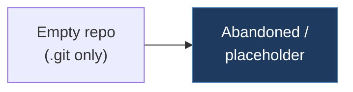

# 1-v-1-tesla-fsd-can-mod

## Overview

This repository is essentially empty — it contains only a `.git` directory with no source code, documentation, or other files. It appears to be an abandoned or placeholder repository, possibly the predecessor to `1-v-1-tesla-open-can-mod`.

## Technical Details

- **Platform**: Unknown (no source code)
- **Language**: Unknown
- **CAN Interface**: N/A
- **License**: None

## Architecture

No source files exist. The repository only contains a `.git` directory.

## CAN Bus Integration

No direct CAN integration — the repository is empty.

## Relevance to Our Project

No useful content to extract. The open-can-mod variant (`1-v-1-tesla-open-can-mod`) is the active version.

- **Reusability**: None
- **Key Takeaways**:
  - This is likely the original private/FSD-specific repo that was superseded by the open variant
