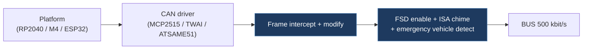

# 1-v-1-tesla-open-can-mod

## Overview

An open-source CAN bus modification firmware for Tesla vehicles that intercepts and re-transmits specific CAN frames to enable Full Self-Driving (FSD) functionality. It supports HW3 (including legacy/retrofit) and HW4 vehicles, with additional features like ISA speed chime suppression and emergency vehicle detection. This is the direct upstream of our Tesla-CAN-Mod project.

## Technical Details

- **Platform**: Adafruit Feather RP2040 CAN, Adafruit Feather M4 CAN Express, ESP32 (TWAI), M5Stack Atomic CAN Base
- **Language**: C++ (Arduino framework)
- **CAN Interface**: MCP2515 (SPI), ATSAME51 native CAN, ESP32 TWAI — all at 500 kbit/s
- **License**: GPL-3.0

## Architecture

- `RP2040CAN.ino` — Arduino IDE entry point; selects board driver and vehicle variant via `#define` directives
- `src/main.cpp` — PlatformIO entry point; mirrors the .ino logic
- `include/app.h` — Core application logic (shared between both entry points)
- `include/handlers.h` — CAN message handlers per vehicle variant (LEGACY, HW3, HW4)
- `include/drivers/` — Abstracted CAN drivers: `mcp2515_driver.h`, `same51_driver.h`, `twai_driver.h`
- `include/can_frame_types.h`, `can_helpers.h` — CAN frame structures and utilities
- `include/log_buffer.h` — Logging infrastructure
- `include/shared_types.h` — Shared state types
- `include/web/` — Web-related components
- `platformio.ini` — Build environments for all hardware targets plus native test environments
- `scripts/` — Build helper scripts (e.g., `platformio_sync_ino_defines.py`)
- `test/` — Native test suites

## CAN Bus Integration

Core CAN interaction on specific message IDs per vehicle variant:

| Variant | Listened CAN IDs | Function |
| ------- | ----------------- | -------- |
| LEGACY | 1006, 69 | FSD enable bit + speed profile via follow distance |
| HW3 | 1016, 1021 | Same as LEGACY with different frame format |
| HW4 | 1016, 1021 | Extended 5-level speed profile range |

- Listens for Autopilot-related CAN frames
- Uses "Traffic Light and Stop Sign Control" toggle as trigger for FSD activation
- Adjusts specific bits in intercepted frames and re-transmits onto vehicle bus
- Maps follow-distance stalk setting to speed profile dynamically
- Optional ISA speed chime suppression and emergency vehicle detection features

## Relevance to Our Project

This is the **direct upstream** of our Tesla-CAN-Mod firmware. Our firmware/ directory is derived from this codebase.

- **Reusability**: High
- **Key Takeaways**:
  - Clean driver abstraction layer (MCP2515 / SAME51 / TWAI) is a solid pattern
  - Vehicle variant selection via compile-time `#define` is well-structured
  - Native test environment (`env:native`) enables offline CI testing without hardware
  - CAN IDs 1016, 1021 (HW3/HW4) and 1006, 69 (LEGACY) are the core intercept targets
  - GPL-3.0 license — our project must comply with copyleft requirements
