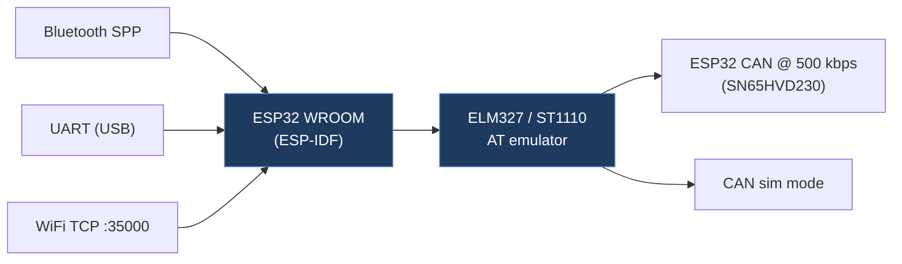

# Akisoft41-TeslapLX

## Overview

An ESP32-based ELM327/ST1110 emulator that bridges a Tesla CAN bus to the "ScanMyTesla" app. It accepts connections over Bluetooth SPP, UART (USB), and WiFi TCP (port 35000), translating OBD-like ELM327 commands into raw CAN reads. It also supports OTA firmware updates, WiFi AP/STA modes, and a basic CAN simulation mode.

## Technical Details

- **Platform**: ESP32 WROOM (ESP-IDF 4.1)
- **Language**: C (native ESP-IDF, not Arduino)
- **CAN Interface**: ESP32 built-in CAN peripheral at 500 kbit/s via SN65HVD230 transceiver
- **License**: Apache-2.0

## Architecture

The project uses ESP-IDF's native build system (CMake) with a well-modularized structure:

| File | Role |
| ---- | ---- |
| `main/main.c` | Entry point — initializes all subsystems, dispatches BT/TCP/UART tasks |
| `main/can.c` / `can.h` | CAN driver — TWAI init, TX/RX, ring-buffer distribution to multiple consumers |
| `main/elm.c` / `elm.h` | ELM327/ST1110 command emulator (partial command set for ScanMyTesla) |
| `main/bt.c` / `bt.h` | Bluetooth SPP server — each connection spawns a dedicated ELM task |
| `main/wifi.c` / `wifi.h` | WiFi AP/STA management, scan, configuration |
| `main/httpd.c` / `httpd.h` | HTTP server for web UI |
| `main/ota.c` / `ota.h` | Over-the-air firmware update via URL |
| `main/uart.c` / `uart.h` | UART/USB serial interface |
| `main/elog.c` / `elog.h` | ESP log level control |

- CAN RX uses FreeRTOS ring buffers to fan out received frames to multiple consumer tasks
- Rate-limits CAN IDs to max 10 messages/second per ID (100 ms throttle)
- Filters for known Tesla CAN IDs only

## CAN Bus Integration

- Initializes ESP32 CAN peripheral at 500 kbit/s with `CAN_FILTER_CONFIG_ACCEPT_ALL()`
- Default pins: TX=GPIO17, RX=GPIO16
- Ring-buffer distribution model allows multiple concurrent consumers (BT, TCP, UART)
- Rate limiting: same CAN ID limited to one message per 100 ms (10 Hz per ID)
- Includes a CAN simulation mode (`SIMU START`/`SIMU STOP`) for testing without a vehicle
- ELM327 emulation translates AT commands and CAN frame requests for ScanMyTesla compatibility

## Relevance to Our Project

Excellent reference for ESP-IDF native CAN implementation and multi-interface bridging.

- **Reusability**: Medium
- **Key Takeaways**:
  - Ring-buffer CAN distribution pattern is a clean design for multi-consumer architectures
  - ELM327 emulation approach useful if we ever need OBD2 tool compatibility
  - CAN simulation mode is valuable for development/testing without vehicle access
  - OTA update implementation could be referenced for our firmware update flow
  - Apache-2.0 license — permissive, compatible with our project
  - Rate-limiting per CAN ID (10 Hz) prevents bus flooding
