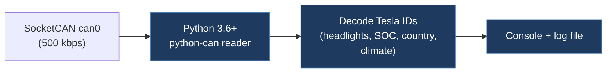

# Arkay92-TeslaCANInterpreter

## Overview

A simple Python script that reads live CAN bus messages from a SocketCAN interface and interprets a handful of Tesla-specific CAN IDs (headlights, charge level, country code, climate control). It provides real-time console output and file logging of decoded frames.

## Technical Details

- **Platform**: Linux (SocketCAN)
- **Language**: Python 3.6+
- **CAN Interface**: SocketCAN (`can0`) via `python-can` library, 500 kbit/s
- **License**: MIT

## Architecture

Single-file project:

- `main.py` — Complete application: CLI argument parsing, CAN bus setup, message read loop, and interpretation logic

Key functions:

| Function | Role |
| -------- | ---- |
| `setup_can_interface()` | Initializes `python-can` Bus with given interface and bustype |
| `read_and_interpret_can_messages()` | Infinite loop reading CAN frames, logging to console and file |
| `interpret_can_message()` | Decodes specific CAN IDs into human-readable data |
| `parse_arguments()` | CLI argument parsing (`--interface`, `--channel_type`) |

## CAN Bus Integration

Interprets a small set of Tesla CAN IDs:

| CAN ID | Hex | Decoded Data                                                               |
| ------ | --- | -------------------------------------------------------------------------- |
| 0x10C  | 268 | Headlight status (On/Off based on byte 0 values 0x89/0x88)                 |
| 0x2C8  | 712 | Charge level (byte 0 as percentage)                                        |
| 0x398  | 920 | Country code (UTF-8 decode of data bytes)                                  |
| 0x268  | 616 | Climate control status (byte 0 = 0x55 for On) and set temperature (byte 6) |

- Passive read-only — does not transmit
- Logs all frames to `tesla_can.log` with timestamps

**Note:** The CAN ID interpretations appear to be basic/approximate and may not be fully accurate for all Tesla models.

## Relevance to Our Project

Minimal but demonstrates the basic pattern for Python-based CAN message decoding on Tesla vehicles.

- **Reusability**: Low
- **Key Takeaways**:
  - Simple `python-can` + SocketCAN setup pattern for Linux-based CAN reading
  - CAN ID reference: 0x10C (headlights), 0x2C8 (charge), 0x398 (country), 0x268 (climate)
  - MIT license — fully permissive
  - Very basic interpretation — would need significant expansion for real use
