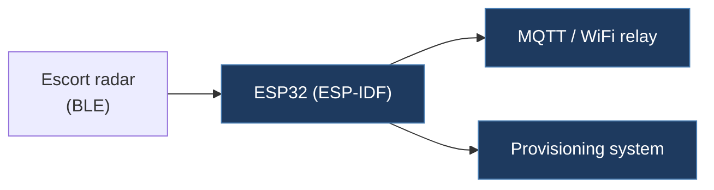

# BluedDot-IT-TeslaCANalyzer-Controller

## Overview

An ESP32-based controller built with ESP-IDF that connects to an Escort radar detector via BLE, relays radar alerts through MQTT and WiFi, and includes a provisioning system. Despite the "TeslaCANalyzer" name, the repo contains no direct Tesla CAN bus code — it is a radar detector integration platform.

## Technical Details

- **Platform**: ESP32 (ESP-IDF framework)
- **Language**: C++
- **CAN Interface**: N/A (no CAN code present)
- **License**: None

## Architecture

- `main/main.cpp` — Entry point; initializes NVS, event loop, BLE, WiFi provisioning, and MQTT
- `main/ble/` — BLE central (client) task for connecting to Escort radar detector
- `main/radar/` — Radar alert processing: handles speed trap, speed camera, red light camera, laser, and police alerts with distance and heading
- `main/mqtt/` — MQTT task for publishing/subscribing radar data
- `main/wifi/` — WiFi station mode setup
- `main/provisioning/` — WiFi provisioning (likely BLE-based)
- `main/interface/` — Interface task (inbox/outbox queue pattern)
- `components/nimble_central_utils/` — NimBLE BLE central utilities
- Uses FreeRTOS tasks and queues throughout

## CAN Bus Integration

No direct CAN integration. The project communicates with an Escort radar detector via BLE (using the Escort proprietary protocol with `0xF5` command prefix) and relays alerts via MQTT. The README is a generic ESP-IDF sample project template and provides no Tesla-specific information.

## Relevance to Our Project

Limited relevance. The BLE central pattern and FreeRTOS task architecture could serve as reference for ESP32 multi-task design, but there is no Tesla CAN bus content.

- **Reusability**: Low
- **Key Takeaways**:
  - Clean ESP-IDF FreeRTOS task/queue architecture pattern
  - BLE central (client) connection pattern with NimBLE
  - MQTT integration for remote telemetry
