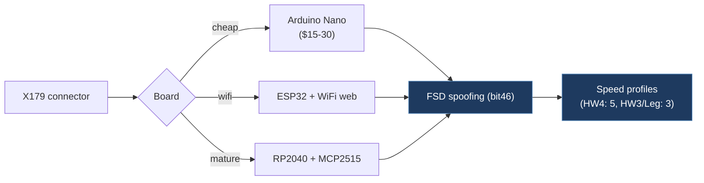

# EzeLLM-fsd-spoofing

**Source:** [github.com/EzeLLM/fsd-spoofing](https://github.com/EzeLLM/fsd-spoofing)  
**License:** GPL-3.0  
**Platform:** Arduino Nano, ESP32, RP2040

## Overview

Complete FSD region spoofing guide with three reference firmware implementations. Focuses on low-cost hardware variants, wiring diagrams, and community-sourced documentation (Canada subscription workaround, Turkey test results).

## Architecture

## Key Features

- FSD Spoofing (bit46) across three hardware platforms
- Detailed X179 connector wiring guides by vehicle model/year
- Canada FSD subscription workaround documentation
- Three firmware variants: ultra-cheap Nano ($15–30), ESP32 with WiFi web control, RP2040
- Speed profiles (5 levels HW4, 3 levels HW3/Legacy)

## Firmware Variants

| Variant | Hardware | Cost | WiFi | Features |
| ------- | -------- | ---- | ---- | -------- |
| `firmware/nano/` | Arduino Nano + MCP2515 | ~$15 | No | Basic FSD enable |
| `firmware/esp32/` | ESP32 + MCP2515 | ~$25 | Yes | FSD + web control |
| `firmware/original/` | RP2040 CAN Feather | ~$40 | No | Original reference |

## Wiring (X179 Connector)

| Vehicle | Connector | CAN-H Pin | CAN-L Pin | Location |
| ------- | --------- | --------- | --------- | -------- |
| Model 3/Y (2017-2023) | 20-pin | 13 | 14 | Right A-pillar |
| Model Y Juniper (2024+) | 26-pin | 13 | 14 | Right A-pillar |
| Model 3 Highland (2024+) | 26-pin | 13 | 14 | Right A-pillar |
| Model S/X AMD (2021+) | Varies | — | — | Model-specific |

## Relevance

- **MEDIUM**: Wiring documentation, low-cost hardware reference
- Canada subscription workaround guide
- Community test results from Turkey
- Reference for supporting Arduino Nano (cheapest option)
