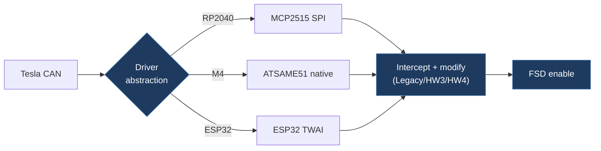

# JelloEa-Tesla-Open-CAN-Mod

## Overview

The main Tesla Open CAN Mod project — a multi-platform firmware that intercepts and modifies Tesla CAN bus messages to enable FSD functionality. Supports three hardware platforms (RP2040 + MCP2515, ATSAME51 native CAN, and ESP32 TWAI) via a driver abstraction layer. Includes comprehensive documentation of CAN message details for Legacy, HW3, and HW4 variants.

## Technical Details

- **Platform**: Adafruit Feather RP2040 CAN, Feather M4 CAN Express (ATSAME51), ESP32 with CAN transceiver, Atomic CAN Base
- **Language**: C++ (Arduino/PlatformIO)
- **CAN Interface**: MCP2515 over SPI / ATSAME51 native MCAN / ESP32 TWAI (all at 500 kbit/s)
- **License**: GPL-3.0

## Architecture

- `src/main.cpp` — PlatformIO entry point. Selects driver at compile time via `DRIVER_MCP2515`, `DRIVER_SAME51`, or `DRIVER_TWAI` macros. Calls templated `appSetup<>()` and `appLoop<>()` functions.
- `include/app.h` — Core application logic (setup/loop) templated on driver type.
- `include/handlers.h` — CAN message handlers for Legacy/HW3/HW4 (FSD enable, speed profile, nag suppression).
- `include/can_frame_types.h` — Portable CAN frame type definitions.
- `include/can_helpers.h` — Bit manipulation utilities.
- `include/drivers/` — Platform-specific CAN driver implementations:
  - `can_driver.h` — Abstract CAN driver base interface
  - `mcp2515_driver.h` — MCP2515 SPI driver
  - `same51_driver.h` — ATSAME51 native CAN driver
  - `twai_driver.h` — ESP32 TWAI driver
  - `mock_driver.h` — Mock driver for native unit tests (no hardware required)
- `RP2040CAN.ino` — Arduino IDE–compatible sketch (same logic, for users who don't use PlatformIO).
- `lib/` — Third-party library sources bundled for PlatformIO.
- `test/` — Test files.
- `guides/` — Additional documentation.

## CAN Bus Integration

Comprehensive CAN message documentation in the README:

**Legacy (HW3 Retrofit)**:

- **0x045 (69)** `STW_ACTN_RQ` — Read follow-distance stalk position for speed profile
- **0x3EE (1006)** — Mux 0: FSD enable (bit 46), speed profile (byte 6 bits 1–2). Mux 1: nag suppression (bit 19)

**HW3**:

- **0x3F8 (1016)** `UI_driverAssistControl` — Read follow-distance for speed profile mapping
- **0x3FD (1021)** `UI_autopilotControl` — Mux 0: FSD enable (bit 46), speed profile. Mux 1: nag suppression (bit 19). Mux 2: speed offset (bits 6–7 byte 0 + bits 0–5 byte 1)

**HW4**:

- **0x399 (921)** `DAS_status` — ISA speed chime suppression (optional)
- **0x3F8 (1016)** `UI_driverAssistControl` — Follow-distance mapping (5 levels)
- **0x3FD (1021)** `UI_autopilotControl` — Mux 0: FSD enable (bit 46), FSD V14 (bit 60), emergency vehicle detection (bit 59). Mux 1: nag suppression (bit 19), bit 47. Mux 2: speed profile (bits 4–6 byte 7)

## Relevance to Our Project

This is the primary upstream reference for our firmware. The driver abstraction layer, multi-platform support, and detailed CAN message documentation are foundational to our project.

- **Reusability**: High
- **Key Takeaways**:
  - Driver abstraction pattern supporting MCP2515, ATSAME51, ESP32 TWAI, and mock (for testing)
  - Templated app logic that works across all platforms
  - Most complete public documentation of Tesla FSD CAN message structure
  - Both Arduino IDE and PlatformIO build support
  - 120Ω termination resistor must be removed when connecting to vehicle CAN bus
  - HW4 firmware version determines FSD version (v13 vs v14) — compile target must match
  - Repository now auto-syncs daily from an upstream GitLab source via GitHub Actions workflow
