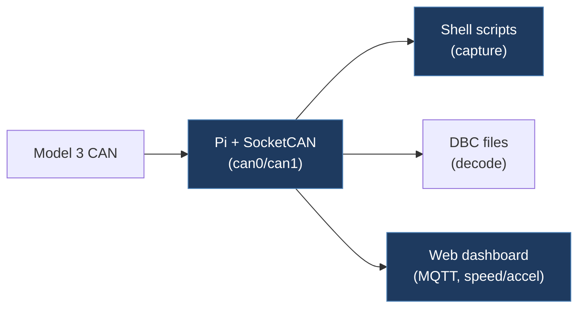

# MatthewDriver-TeslaCAN

## Overview

A Tesla Model 3 CAN bus logging and visualization toolkit built around a Raspberry Pi with SocketCAN. It includes shell scripts for CAN interface setup and data capture, Python scripts for log conversion, DBC files for decoding Tesla Model 3 CAN frames, and a web-based MQTT dashboard for real-time visualization of vehicle data like speed and acceleration.

## Architecture

## Technical Details

- **Platform**: Raspberry Pi (Linux/SocketCAN)
- **Language**: Bash, Python, JavaScript/HTML
- **CAN Interface**: SocketCAN (can0, can1 at 500kbps), with virtual CAN (vcan0, vcan1) support
- **License**: MIT (Copyright 2022 Chuck Cook)

## Architecture

- `scripts/can_setup.sh` — Configures SocketCAN interfaces (can0, can1 at 500kbps) and virtual CAN (vcan0, vcan1)
- `scripts/canlogging.sh` — Captures raw CAN data via `candump` to timestamped log files
- `scripts/Model3CAN.dbc` — DBC file with Tesla Model 3 signal definitions (UI status, autopilot, cell info, etc.)
- `scripts/fsdtest.dbc` — Additional DBC file for FSD-related testing
- `scripts/mqttpy.py` — MQTT publisher for streaming CAN data
- `scripts/convertbinary.py`, `convertRawASC.py` — Log format conversion utilities
- `www/index.html` — MQTT-connected web dashboard using D3.js for real-time vehicle data visualization (speed, acceleration graphs)
- `SteeringDemo.mp4` — Demo video

## CAN Bus Integration

- Sets up dual CAN interfaces at 500kbps via SocketCAN
- DBC file (`Model3CAN.dbc`) defines signals including: `UI_audioActive`, `UI_autopilotTrial`, `UI_cellSignalBars`, `UI_cpuTemperature`, `UI_developmentCar` on CAN ID 0x00C (12)
- Uses `candump` for raw capture and MQTT for real-time data streaming
- Web dashboard subscribes to MQTT topics for live visualization

## Relevance to Our Project

Provides a comprehensive CAN logging pipeline and Tesla Model 3 DBC definitions that are useful for protocol research. The web dashboard pattern (MQTT + D3.js) could inform our own visualization tools.

- **Reusability**: Medium
- **Key Takeaways**:
  - Tesla Model 3 DBC signal definitions (CAN ID 0x00C and more)
  - SocketCAN setup scripts for dual-interface configuration at 500kbps
  - MQTT-based real-time CAN data streaming architecture
  - D3.js web dashboard for vehicle telemetry visualization
