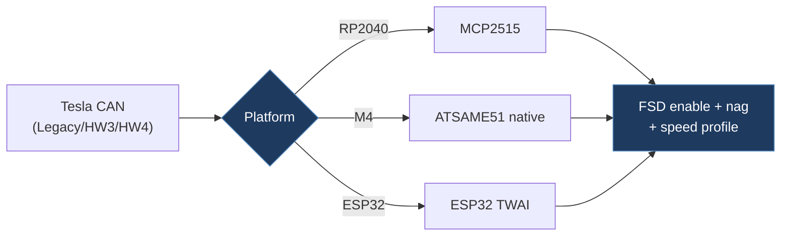

# MrStarTraveller-tesla-fsd-can-mod

## Overview

A well-structured, multi-platform Tesla FSD CAN bus enabler firmware based on the Starmixcraft project. Supports three hardware targets (Adafruit Feather RP2040 CAN with MCP2515, Feather M4 CAN Express with native ATSAME51, and ESP32 with TWAI), three vehicle variants (Legacy/HW3/HW4), and includes PlatformIO build configs, unit tests, and bilingual documentation (Chinese/English). This is effectively the most mature community fork of the FSD CAN mod project.

## Architecture

## Technical Details

- **Platform**: RP2040 (Adafruit Feather CAN), ATSAME51 (Feather M4 CAN), ESP32 (TWAI), M5Stack Atomic CAN Base
- **Language**: C++17 (Arduino framework)
- **CAN Interface**: MCP2515 (SPI), ATSAME51 native CAN, ESP32 TWAI — abstracted via driver interface
- **License**: GPL-3.0

## Architecture

Clean separation of concerns with a driver abstraction layer:

- `RP2040CAN.ino` / `src/main.cpp` — Entry points for Arduino IDE and PlatformIO respectively
- `include/app.h` — Shared setup and main loop logic
- `include/handlers.h` — Vehicle logic with three handler classes:
  - `LegacyHandler` — HW3 retrofit with vertical screen (CAN IDs 1006, 69)
  - `HW3Handler` — HW3 vehicles with horizontal screen (CAN IDs 1016, 1021)
  - `HW4Handler` — HW4 vehicles, extended 5-level speed profile (CAN IDs 1016, 1021)
- `include/can_helpers.h` — Bit manipulation utilities for CAN frames
- `include/can_frame_types.h` — Platform-agnostic CAN frame struct
- `include/drivers/` — Hardware abstraction:
  - `can_driver.h` — Abstract CAN driver base interface
  - `mcp2515_driver.h` — MCP2515 SPI driver
  - `same51_driver.h` — ATSAME51 native CAN driver
  - `mock_driver.h` — Test mock driver
- `test/` — Host-side unit tests (native platform)
- `scripts/` — Build helpers (`pio-local.ps1`, `native_toolchain.py`)
- `guides/` — Documentation and images
- `platformio.ini` — Multi-environment build config (5 targets)

## CAN Bus Integration

- **CAN IDs monitored**: 69 (steering wheel action), 921 (DAS status), 1006 (Legacy autopilot), 1016 (UI driver assist), 1021 (UI autopilot control)
- **Key bit positions**:
  - Bit 19: Nag acknowledgement (cleared to suppress)
  - Bit 46: FSD enable bit (set to activate)
  - Bit 47: HW4 nag acknowledge bit
  - Bit 59: Emergency vehicle detection
  - Bit 60: FSD v14 indicator
- **Speed profiles**: Legacy/HW3 use 3 levels (0-2), HW4 uses 5 levels (0-4) mapped from follow-distance stalk
- **Speed offset**: Calculated from `(frame.data[3] >> 1) & 0x3F`, clamped to 0-100 range
- Follow distance read from `(frame.data[5] & 0b11100000) >> 5`
- Emergency vehicle detection support (configurable)
- ISA speed chime suppression (configurable)

## Relevance to Our Project

This is essentially the upstream reference implementation for our firmware. our project's `firmware/` directory is derived from this codebase. The multi-platform driver abstraction, handler architecture, and unit test setup directly inform our own structure.

- **Reusability**: High
- **Key Takeaways**:
  - Driver abstraction pattern supporting MCP2515, ATSAME51, and ESP32 TWAI
  - Clean handler hierarchy (Legacy → HW3 → HW4) with well-defined CAN bit positions
  - PlatformIO multi-environment build configuration (5 targets including native tests)
  - HW4/FSD v14 support with emergency vehicle detection and 5-level speed profile
  - Host-side unit test framework with mock CAN driver
  - FSD v14 vs v13 versioning logic (firmware 2026.2.9+ = v14, 2026.8.X = v13)
  - ISA speed chime suppression flag
  - Community Discord for support (discord.gg/ZTQKAUTd2F)
