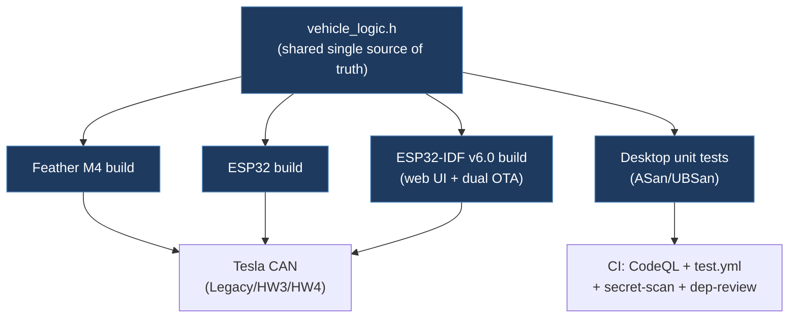

# Shayennn-FUCKYOU-TESLA-FSD

**Source:** [github.com/Shayennn/FUCKYOU-TESLA-FSD](https://github.com/Shayennn/FUCKYOU-TESLA-FSD)  
**License:** GPL-3.0 (feather/) / MIT (esp32/)  
**Platform:** Feather M4, ESP32, ESP32-IDF v6.0

## Overview

Portable FSD enabler with a shared `vehicle_logic.h` header that is reused across Feather, ESP32, ESP32-IDF, and desktop test builds. Features CI with sanitizer-backed tests, dual OTA slots, and flash coredumps.

## Architecture



## Key Features

- FSD Activation (HW3/HW4/Legacy via shared logic)
- Nag Killer (bit19 clear)
- Speed Profiles (5 levels HW4, 3 levels HW3/Legacy)
- Shared `vehicle_logic.h` — single source of truth for CAN frame manipulation
- Desktop unit tests with sanitizers (ASan/UBSan)
- CI pipeline: CodeQL, test.yml, secret-scan, dependency-review
- ESP32-IDF v6.0 production build with web UI and dual OTA

## CAN IDs

| ID | Hex | Signal | Usage |
| -- | --- | ------ | ----- |
| 1006 | 0x3EE | Legacy autopilot | FSD enable (Legacy) |
| 1016 | 0x3F8 | Follow distance | Speed profile + mux routing |
| 1021 | 0x3FD | Autopilot control | FSD enable (HW3/HW4) |

## Architecture

```
shared/vehicle_logic.h  ← Golden source for CAN frame handlers
├── feather/            ← Adafruit Feather M4 CAN firmware
├── esp32/              ← ESP32 Arduino sketch
├── esp32-idf/          ← ESP32-IDF v6.0 production (web UI + OTA)
└── test/               ← Desktop tests using same vehicle_logic.h
```

## Relevance

- **HIGH**: Portable handler pattern worth studying for architecture improvements
- Desktop test strategy: compile same C handlers for x86 and test directly
- ESP-IDF v6.0 reference for advanced ESP32 support
- CI best practices (sanitizer-backed tests, CodeQL)
