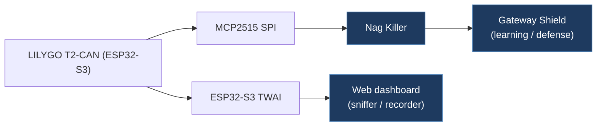

# alzza-tesla-open-can-mod

> **Repository deleted.** `https://github.com/alzza/tesla-open-can-mod` returned 404 as of May 2026. Content below is preserved from the last recorded state.

## Overview

A Korean-language fork/extension of the Tesla Open CAN Mod project, targeting HW3 EAP (Enhanced Autopilot) vehicles using a LILYGO T2-CAN board (ESP32-S3). It adds dual-channel CAN support (MCP2515 SPI + ESP32-S3 TWAI), a Nag Killer feature, a web dashboard with CAN sniffer/recorder, OTA updates, and a Gateway Shield learning/defense engine. This is the most feature-rich fork in the legacy collection.

## Technical Details

- **Platform**: LILYGO T2-CAN (ESP32-S3)
- **Language**: C++ (Arduino framework, PlatformIO)
- **CAN Interface**: Dual-channel — A-channel: MCP2515 (SPI), B-channel: ESP32-S3 TWAI
- **License**: GPL-3.0

## Architecture


Version 2.3.0 with a significantly expanded codebase:

| Component | Role |
| --------- | ---- |
| `src/main.cpp` | Dual-channel entry point, serial command interface (ATEST/BTEST/ASIM/BSIM/TEST/STAT) |
| `include/app.h` | Core application loop |
| `include/handlers.h` | HW3 handler (A-channel), Nag handler (B-channel) |
| `include/drivers/` | MCP2515, TWAI, and Mock drivers |
| `include/plugin_engine.h` | Plugin architecture for extensible features |
| `include/serial_test_runner.h` | On-device serial test framework |
| `include/t2can_pins.h` | Board-specific pin definitions |
| `include/web/` | Web dashboard, CAN sniffer, CAN recorder, OTA |
| `include/version.h` | Version tracking |
| `scripts/` | Build scripts including native env setup |
| `test/` | Native tests for Nag, HW4, Legacy, GTW modules |
| `tools/` | Utilities including `demo.html` for dashboard preview |
| `guides/` | Wiring guide and documentation |
| `docs/` | Images and additional documentation |

Architecture overview (from source):

```plaintext
CAN Bus A ──► MCP2515(SPI) ──► appLoop() ──► HW3Handler
                                 ├── sniffPush() → Web CAN Sniffer
                                 └── recPush()  → Web CAN Recorder

CAN Bus B ──► TWAI(GPIO) ──► nagKillerTask() ──► NagHandler

WiFi AP "TeslaCAN" ──► esp_http_server ──► Web Dashboard
```

## CAN Bus Integration

**A-Channel (MCP2515 SPI):**

- Intercepts CAN ID 1021 Mux1 frames
- Modifies `UI_applyEceR79` bit to bypass ECE R79 restrictions on EAP features
- Controlled by `ENHANCED_AUTOPILOT` build flag

**B-Channel (ESP32-S3 TWAI):**

- Nag Killer: monitors ID 880 and sends echo frames with natural torque variation to suppress steering wheel nag warnings
- Controlled by `NAG_KILLER` build flag

**Gateway Shield:**

- `GTW_SHIELD` build flag enables learning/defense engine for CAN ID 0x7FF gateway frames

**Vehicle connection:**

- A-channel: X179 connector pins 13(+) / 14(-)
- B-channel: X179 connector pins 2(+) / 3(-)
- Tested on Model Y 2023 RWD, SW 26.2.6

**Web Dashboard** (WiFi AP `TeslaCAN`, password `asdf1234`, IP `192.168.4.1`):

- Real-time CAN sniffer for both channels
- CAN frame recording with start/stop/download
- Runtime feature toggle (EAP, Nag Killer, logging)
- Per-channel diagnostics (RX stats, ID period, injection counters, BUS-OFF history)

## Relevance to Our Project

This is the most feature-complete fork and demonstrates dual-channel CAN architecture, web dashboard, and nag killer — features directly applicable to our project.

- **Reusability**: High
- **Key Takeaways**:
  - Dual-channel CAN (MCP2515 + TWAI) architecture on single ESP32-S3 board
  - Plugin engine design for feature modularity
  - Nag Killer implementation with natural torque variation on ID 880
  - Gateway Shield (0x7FF) learning/defense engine
  - Web dashboard with real-time CAN sniffer and recorder
  - Serial test runner for on-device testing (ATEST/BTEST/ASIM/BSIM)
  - Native test environments for CI without hardware
  - ECE R79 bypass via `UI_applyEceR79` bit in ID 1021
  - X179 connector pinout documented for Model 3/Y
