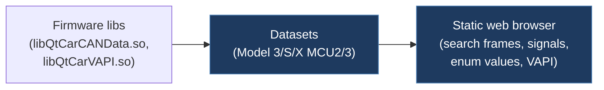

# bruvv-tesla-can-explorer

## Overview

A web-based research portal for browsing decoded Tesla CAN frames and signal value maps. Contains large JSON datasets extracted from Tesla firmware libraries (`libQtCarCANData.so`, `libQtCarVAPI.so`) for Model 3 MCU2/MCU3 and Model S/X MCU2/MCU3, with a searchable browser UI for exploring frames, signals, enum values, and VAPI aliases.

## Technical Details

- **Platform**: Static web application (Python HTTP server for local use)
- **Language**: JavaScript / HTML / CSS
- **CAN Interface**: N/A (data reference only, no hardware interaction)
- **License**: 0BSD (BSD Zero Clause License)

## Architecture

- `app.js` — Main application: loads JSON datasets, renders frame list and signal detail panels, provides search/filter/sort across frames, signals, enums, and VAPI aliases
- `index.html` — Single-page app with left (frame list) and right (signal detail) panels
- `styles.css` — Styling
- `data/` — Pre-decoded CAN frame datasets:
  - `can_frames_decoded_all_values_mcu2.json` / `mcu3.json` / `modelsx_amd.json` / `modelsx_intel.json` — Full frame+signal+enum data per variant
  - `can_frames_decoded_all_values.json` — Combined dataset (all variants)
  - `can_frames_decoded_enum_values_*.csv` — Enum value exports per variant
  - `can_frames_decoded_enum_values.csv` — Combined enum value export
  - `vapi_can_digest_*.json` — VAPI CAN digest data per variant
  - `vapi_can_digest.json` — Combined VAPI CAN digest
  - `vapi_eth_signal_aliases_*.csv` — VAPI Ethernet signal alias mappings

## CAN Bus Integration

No direct CAN hardware integration. Instead, provides a comprehensive **decoded reference** of Tesla CAN frames extracted from firmware `2026.2`. The datasets cover Model 3 (MCU2 Intel, MCU3 AMD) and Model S/X (MCU2 Intel, MCU3 AMD), including frame addresses, signal definitions, enum value maps, and VAPI (Vehicle API) alias mappings.

## Relevance to Our Project

Extremely valuable as a **CAN signal reference database**. The pre-decoded JSON datasets from Tesla firmware are the most authoritative source of CAN frame definitions available, covering all signal names, bit positions, enum values, and VAPI aliases. The 0BSD license allows unrestricted use.

- **Reusability**: High
- **Key Takeaways**:
  - Pre-decoded CAN frame datasets from Tesla firmware 2026.2 (Model 3 + Model S/X)
  - Signal-level enum value maps for all known CAN signals
  - VAPI (Vehicle API) alias mappings linking CAN signals to high-level API names
  - Searchable web UI for frame/signal exploration
  - 0BSD license — completely unrestricted use
  - Sourced from `libQtCarCANData.so` and `libQtCarVAPI.so`
