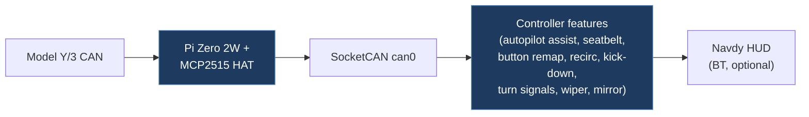

# canhackers-jupiter

## Overview

A comprehensive Raspberry Pi-based Tesla CAN bus controller/automator for Tesla Model Y/3. Reads CAN data via SocketCAN, provides features like autopilot assist, rear seatbelt buckle emulation, button remapping (map lamps, parking button), automatic recirculation, kick-down, alternate turn signals, wiper speed control, mirror folding, door control, drive logging, and optional Navdy HUD integration via Bluetooth. Written in Korean with detailed hardware setup instructions.

## Technical Details

- **Platform**: Raspberry Pi Zero 2W + Waveshare RS485 CAN HAT (MCP2515)
- **Language**: Python
- **CAN Interface**: SocketCAN (`can0`) via MCP2515 CAN HAT at 500 kbit/s
- **License**: CC BY-NC 4.0 (Attribution-NonCommercial)

## Architecture

- `jupiter.py` — Main application: initializes CAN bus, loads feature modules, reads CAN messages in a loop, dispatches to Buffer and feature handlers
- `tesla.py` — **Not present in the repository** (imported by `jupiter.py` but not committed — the module provides `Buffer`, `Dashboard`, `Logger`, `Autopilot`, `RearCenterBuckle`, `ButtonManager`, `FreshAir`, `KickDown`, `TurnSignal`, `Reboot`, `BatteryLogger`, and `monitoring_addrs` classes, but the file is absent, making the project non-runnable as published)
- `functions.py` — CAN bus initialization (`modprobe mcp251x`, `ip link set can0`), JSON settings loader
- `packet_functions.py` — Bit-level CAN packet manipulation: `get_value()` (extract bits with endian/signed support), `modify_packet_value()`, `make_new_packet()`
- `navdy.py` — Navdy HUD Bluetooth integration: connects via RFCOMM, sends JSON payloads for speed/navigation display
- `beacon.py` — Unknown (likely BLE beacon functionality)
- `jupiter_slim_case.stl` — 3D-printable enclosure for the hardware

## CAN Bus Integration

Extensive Tesla Model 3/Y CAN integration with both reading and writing:

- **Monitored CAN IDs** (50+ addresses): 0x108 (torque), 0x118 (drive system status), 0x257 (speed), 0x292 (BMS SOC), 0x33a (range/SOC), 0x3f5 (lighting), 0x528 (Unix time), and many more
- **Multiplexed frame handling**: Supports mux packets with configurable mux bit widths (e.g., 0x282: 2-bit mux, 0x32c: 8-bit mux)
- **CAN write commands**: Pre-built command packets for volume up/down, speed up/down, distance near/far, door open (FL/FR/RL/RR)
- **Button remapping**: Reads map lamp and parking button states from CAN IDs 0x3c2 (VCLEFT_switchStatus) and 0x31a (VCRIGHT_switchStatus), supports short/long/double press with configurable actions
- **Autopilot assist**: Speed offset control, follow distance management, wiper speed persistence
- Tested on Tesla Model Y 2021 (Made in USA) using Model 3 DBC file definitions

## Relevance to Our Project

Highly relevant — a mature, feature-rich Tesla CAN controller with extensive CAN ID documentation, bit-level packet manipulation utilities, and many practical vehicle features. The Korean comments require translation but the code is well-structured.

- **Reusability**: High
- **Key Takeaways**:
  - Comprehensive list of 50+ monitored Tesla CAN IDs with human-readable names
  - Pre-built CAN command packets for vehicle controls (volume, speed, doors)
  - Bit-level packet manipulation utilities (`get_value`, `modify_packet_value`) with endian and signed support
  - Multiplexed frame buffer system with configurable mux bit widths
  - Button remapping system with short/long/double press detection
  - Autopilot assist features (speed offset, follow distance, wiper control)
  - Navdy HUD integration pattern (Bluetooth RFCOMM + JSON payloads)
  - Drive logging to CSV with timestamped CAN data
  - Hardware: Raspberry Pi Zero 2W + Waveshare CAN HAT is a proven platform
  - CC BY-NC 4.0 license — non-commercial use only
