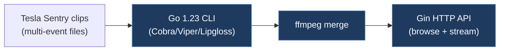

# denysvitali-tesla-sentry-viewer

## Overview

A Go-based tool for processing and serving Tesla Sentry Mode video clips. It merges multiple sentry event video files into single files using ffmpeg and provides an HTTP API server (via Gin framework) for browsing and streaming sentry clips. Features a modern CLI with Cobra/Viper, Docker support, and rich terminal UI with Lipgloss.

## Technical Details

- **Platform**: Linux/macOS/Windows (Go binary)
- **Language**: Go 1.23
- **CAN Interface**: N/A (video processing tool, no CAN interaction)
- **License**: MIT

## Architecture

- `cmd/server/` — CLI entry point using Cobra command framework
- `pkg/sentry.go` — Core sentry event handling logic
- `pkg/clip/` — Video clip processing
- `pkg/event/` — Sentry event model and parsing
- `pkg/server/` — HTTP API server (Gin framework with CORS)
- `pkg/config/` — Configuration management via Viper (YAML, env vars, CLI flags)
- `pkg/errors/` — Error handling
- `convert.sh` / `merge.sh` — Shell scripts for video merge operations
- `Dockerfile` — Containerized deployment with health checks
- `config.example.yaml` — Example configuration file

## CAN Bus Integration

No direct CAN integration. This is a video processing and serving tool for Tesla Sentry Mode footage. It works with the MP4 video files stored on Tesla's USB drive, not with vehicle CAN bus data.

## Relevance to Our Project

Not relevant to CAN bus work. This is a video processing utility for Sentry Mode clips.

- **Reusability**: None
- **Key Takeaways**:
  - Well-structured Go project with modern CLI patterns (Cobra/Viper) that could serve as an architectural reference for Go-based tooling
  - Docker deployment pattern with health checks
