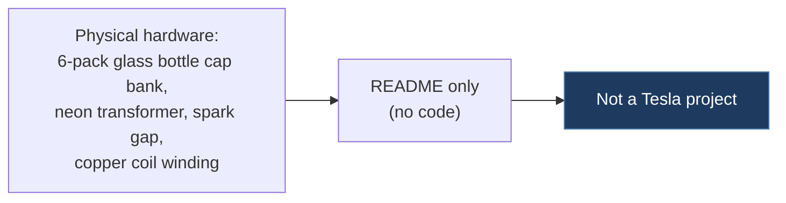

# devon-smith-six-pack-capacitor-tesla-coil

## Overview

A hardware documentation repo for a homemade Tesla coil (the electrical device, not the car company) built with a six-pack glass bottle capacitor bank, neon sign transformer, spark gap, and copper coil windings. This has nothing to do with Tesla vehicles or CAN bus — it is a high-voltage electrical engineering hobby project.

## Technical Details

- **Platform**: N/A (physical hardware project)
- **Language**: N/A (README only, no code)
- **CAN Interface**: N/A
- **License**: None

## Architecture

The repo contains only a `README.md` with build documentation and photos. No source code exists.

## CAN Bus Integration

No direct CAN integration. This is an unrelated Tesla coil (electromagnetic device) project, not a Tesla vehicle project.

## Relevance to Our Project

Not relevant. This repo is about a Tesla coil (the electromagnetic resonant transformer) and has no connection to Tesla vehicles or CAN bus.

- **Reusability**: None
- **Key Takeaways**:
  - None — this is a false positive from the "Tesla" keyword in repository search
