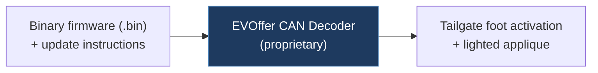

# evoffer / can-decoder-firmware

## Overview

A collection of binary firmware files for EVOffer's commercial CAN Decoder product, designed to enable tailgate foot activation and lighted applique features on Tesla Model S/X/3/Y. This repo contains only pre-compiled `.bin` files and update instructions — no source code is included.

## Technical Details

- **Platform**: Unknown (proprietary hardware — "CAN Decoder" with microSD slot and LED indicator)
- **Language**: N/A (binary firmware only)
- **CAN Interface**: Unknown (proprietary CAN decoder hardware)
- **License**: None

## Architecture

The repository contains only firmware binaries organized by hardware version and software revision:

- `decoder hw1 sw20X formware.bin` — Hardware v1.00 firmware images
- `decoder hw100 sw2XX formware.bin` — Hardware v1.00 firmware images (alternate naming)
- `decoder hw115 sw2XX wsoft0.bin` — Hardware v1.15 firmware images
- `decoder hw200 sw2XX wsoft0.bin` — Hardware v2.00 firmware images
- `README.md` — Update instructions (microSD-based flashing process)

No source code, schematics, or protocol documentation is provided.

## CAN Bus Integration

The product interacts with Tesla CAN bus to provide:

- Tailgate foot activation (kick sensor under rear bumper)
- Lighted applique effects (charging animation on Model S/X)
- Blind spot signal integration
- Car wash mode for Model 3/Y tailgate
- Emergency flashlight interlock (disables foot activation when hazards are on)

Specific CAN message IDs and protocols are not documented — this is a closed-source commercial product.

## Relevance to Our Project

Very low relevance. This is a closed-source commercial product with only binary firmware blobs. The feature set (tailgate kick, lighting effects) is unrelated to FSD/autopilot CAN modifications.

- **Reusability**: None
- **Key Takeaways**:
  - Example of a commercial Tesla CAN bus product with microSD-based OTA update mechanism
  - Shows that Tesla CAN bus is used for body control features (tailgate, lighting) beyond autopilot
