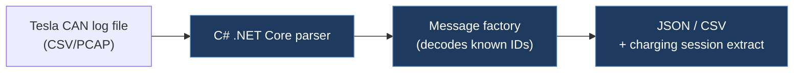

# hanswolff / TeslaCanBusInspector

## Overview

A .NET Core desktop application that parses Tesla CAN bus log files (captured from the vehicle) and converts them to structured formats (JSON, CSV). It includes a message factory that decodes known Tesla Model 3 CAN messages into typed objects with proper unit conversions, and can extract charging session data from log files.

## Technical Details

- **Platform**: PC (.NET Core 3.0)
- **Language**: C# (.NET)
- **CAN Interface**: N/A — offline log file parser (does not connect to CAN bus directly)
- **License**: MIT

## Architecture

The solution is split into three projects:

- **TeslaCanBusInspector/** — Main CLI application
  - `Program.cs` — Entry point; processes command-line args, runs charging session extraction
  - `CanBusLogFileToJson.cs` — Converts raw CAN log files to JSON using the message factory
  - `Model3/Model3CanBusLogFileToCsv.cs` — Converts Model 3 CAN logs to CSV with timestamped rows
  - `Model3/Model3ChargingSessionsToCsv.cs` — Extracts and exports charging session data
- **TeslaCanBusInspector.Common/** — Shared library
  - `Messages/` — Typed CAN message classes for Model 3
  - `LogParsing/` — CAN bus log line parser
  - `ValueTypes/` — Unit types (Ampere, Volt, etc.)
  - `Statistics/`, `Session/`, `Interpolation/` — Data analysis utilities
  - `CanBusMessageFactory.cs` — Maps CAN IDs to typed message classes
- **TeslaCanBusInspector.Tests/** — Unit tests

## CAN Bus Integration

No direct CAN integration — this is an offline analysis tool. It parses CAN bus log files (likely captured via tools like SavvyCAN or similar CAN loggers) and decodes Model 3 messages. The Common library contains typed message definitions that map CAN IDs to signal names, bit positions, scaling, and units for the Tesla Model 3.

## Relevance to Our Project

Low to moderate relevance. Useful as a reference for Tesla Model 3 CAN message definitions and signal decoding, but it's an offline analysis tool rather than real-time firmware.

- **Reusability**: Low — different tech stack (.NET), different purpose (offline analysis vs. real-time CAN modification)
- **Key Takeaways**:
  - Model 3 CAN message definitions with typed signal parsing (useful as a DBC reference)
  - Charging session extraction logic from CAN bus data
  - CAN log file parsing approach (timestamps, message IDs, payloads)
  - MIT licensed — more permissive than our GPL-3.0 project
