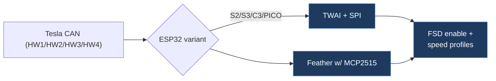

# herrfrei / tesla-fsd-canbus-esp32

## Overview

An ESP32 + MCP2515 Arduino sketch that intercepts and modifies Tesla CAN bus frames to enable FSD functionality and configure speed profiles. It is an unofficial port of the original Starmixcraft gitlab firmware, adding support for ESP32-S2, S3, C3, and PICO targets with documented wiring for each variant. Supports Legacy (HW1/HW2), HW3, and HW4 Tesla hardware.

## Architecture

## Technical Details

- **Platform**: ESP32 (S2, S3, C3, PICO-D4, PICO-V3) with MCP2515 CAN module
- **Language**: C++ (Arduino IDE)
- **CAN Interface**: MCP2515 via SPI (MCP2515+TJA1050, MCP2515+MCP2551, or MCP2515+SN65HVD230)
- **License**: GPL-3.0 (stated in source code header)

## Architecture

Single-file Arduino sketch with clean OOP design:

- `CanFeather.ino` — The entire firmware in one file
  - **Pin configuration** — Compile-time `#ifdef` blocks auto-select SPI pins for each ESP32 variant
  - **`CarManagerBase`** — Base struct with virtual `handelMessage()` method
  - **`LegacyHandler`** — Handles CAN ID 1006 for HW1/HW2 vehicles (3-level speed profile)
  - **`HW3Handler`** — Handles CAN IDs 1016 + 1021 for HW3 (3-level profile + speed offset)
  - **`HW4Handler`** — Handles CAN IDs 1016 + 1021 for HW4/FSDV14 (5-level profile, bit46+bit60)
  - `setBit()` — Inline helper for modifying individual bits in CAN frame data
  - `readMuxID()`, `isFSDSelectedInUI()`, `setSpeedProfileV12V13()` — CAN signal extraction helpers
- `CONNECTION.md` — Detailed wiring diagrams for all ESP32 variants with ASCII art

## CAN Bus Integration

Direct CAN bus frame interception and modification at 500 kbps:

- **CAN ID 0x3EE (1006)** — Legacy autopilot control: sets FSD enable bit (bit46), nag suppression (bit19), speed profile
- **CAN ID 0x3FD (1021)** — HW3/HW4 autopilot control:
  - Mux 0: FSD enable bit46 (+bit60 on HW4), speed profile via `setSpeedProfileV12V13()`
  - Mux 1: Nag suppression (bit19 clear, +bit47 set on HW4)
  - Mux 2: Speed offset encoding (HW3) or speed profile encoding (HW4, bits 4-6 of byte 7)
- **CAN ID 0x3F8 (1016)** — Follow-distance stalk reading (byte 5, bits 5-7) mapped to speed profile
- FSD activation is triggered by reading the "Traffic Light and Stop Sign Control" toggle from the CAN frame
- Uses MCP2515 library by autowp for SPI CAN communication

## Relevance to Our Project

High relevance — this is essentially a simpler, single-file version of the same CAN modification logic our project implements. The clean handler pattern and per-chip pin configuration are well-documented reference implementations.

- **Reusability**: Medium — useful as a reference implementation, but our project already has a more mature version with WiFi dashboard and plugin support
- **Key Takeaways**:
  - Clean polymorphic handler pattern (`LegacyHandler`/`HW3Handler`/`HW4Handler`) with virtual dispatch
  - Complete ESP32 variant pin mapping (S2, S3, C3, PICO) with compile-time selection
  - MCP25625 vs MCP2515 module comparison and wiring notes
  - Termination resistor guidance (remove 120Ω — Tesla bus is already terminated)
  - HW4 FSDV14 bit manipulation differs from HW3 (bit60, bit47 additions, 5-level speed profile)
