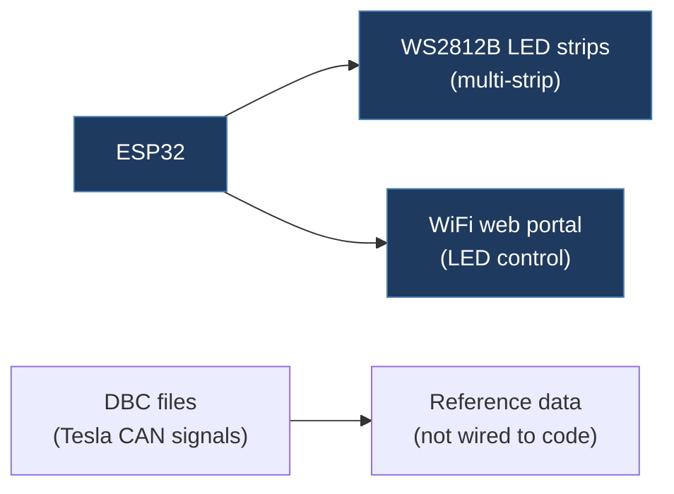

# honeer / Tesla-ESP-CAN

## Overview

A collection of ESP32 projects for Tesla vehicles that includes an ESP-NOW-based multi-strip WS2812B LED controller with a WiFi web portal, along with Tesla DBC (CAN database) files. Despite the repo name suggesting CAN bus functionality, the primary code content is an LED lighting controller — the CAN-related content is limited to included DBC files.

## Technical Details

- **Platform**: ESP32
- **Language**: C++ (Arduino IDE)
- **CAN Interface**: N/A for the LED controller code; DBC files reference Tesla CAN signals
- **License**: None (no LICENSE file; DBC files have a separate contribution note)

## Architecture

The repo is organized into numbered directories:

- `1. Get MAC Address/` — Simple Arduino sketch to retrieve ESP32 MAC address (for ESP-NOW pairing)
- `2. For Testing/` — Test sketches (not examined in detail)
- `3. Functional Versions/`
  - `ESP-NOW With Web Server/` — ESP-NOW receiver with web interface
  - `ESP_PORTAL/ESP_PORTAL.ino` — Full WS2812B LED controller with WiFi AP, web dashboard, animations, and persistent settings via NVS/SPIFFS. Controls 5 LED strips with per-strip color, brightness, direction, and animation settings.
- `Tesla DBC CAN Messages/`
  - `TeslaCAN.dbc` — Full Tesla CAN database file
  - `TeslaCANFiltered.dbc` — Filtered version with commonly used signals
  - `Contribution.txt`, `LICENSE.txt` — Attribution and licensing for DBC files

## CAN Bus Integration

No direct CAN bus integration in the code. The LED controller is a standalone WiFi-controlled lighting system. However, the included DBC files contain Tesla CAN signal definitions that could be useful as reference material.

## Relevance to Our Project

Low relevance for the LED controller code. The Tesla DBC files could be a useful reference, but they are commonly available from other sources (e.g., joshwardell/model3dbc).

- **Reusability**: Low
- **Key Takeaways**:
  - Includes Tesla CAN DBC files (full and filtered versions) that define signal names, bit positions, and scaling
  - The ESP32 WiFi AP + web portal pattern (AsyncWebServer, WebSocket, ArduinoJson) could inform dashboard design
  - ESP-NOW protocol usage between ESP32 devices (potential for multi-node setups)
