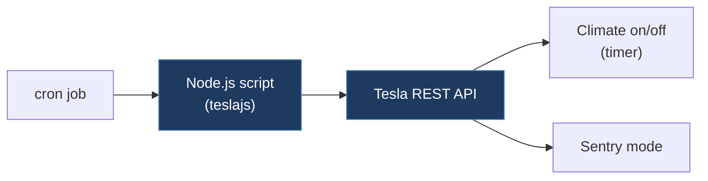

# jberstler-tesla-warmer

## Overview

A small collection of Node.js scripts that control Tesla vehicles via the Tesla REST API (using the `teslajs` library). Includes scripts to automatically start/stop climate control on a timer and to enable Sentry Mode. Designed to be run via cron jobs on a personal server.

## Technical Details

- **Platform**: Node.js
- **Language**: JavaScript
- **CAN Interface**: N/A (uses Tesla REST API, not CAN bus)
- **License**: MIT

## Architecture

- `start_climate.js` — Logs into the Tesla API, starts climate control, waits a configurable number of minutes, then turns it off. Checks for open doors and driver presence before acting.
- `start_sentry_mode.js` — Logs into the Tesla API and enables Sentry Mode.
- `package.json` — Dependencies: `teslajs` v4.3.3 and `simple-node-logger`.

> **Note**: A `lib/tesla_common.js` shared-utilities module is referenced in descriptions of this project but is not present in the repository as committed.

## CAN Bus Integration

No direct CAN integration. This project interacts with the vehicle exclusively through the Tesla REST API over the internet.

## Relevance to Our Project

Not directly relevant to CAN bus modding. However, demonstrates Tesla API-based vehicle control patterns that could complement CAN-level control for features like remote climate preconditioning.

- **Reusability**: None
- **Key Takeaways**:
  - Example of Tesla REST API usage with `teslajs` library
  - Safety checks: minimum battery level, door state, driver presence before activating features
  - Pattern for timed feature activation/deactivation
