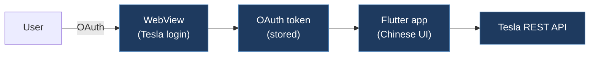

# jiezaichan-teslaAuthFlutter

## Overview

A Flutter mobile application for Tesla vehicle authentication and real-time control. Uses a WebView to handle Tesla OAuth login, stores the auth token locally, and provides a UI to control the vehicle. Written primarily in Chinese with a Tesla-themed dark UI.

## Technical Details

- **Platform**: Flutter (Android/iOS/macOS/Web)
- **Language**: Dart
- **CAN Interface**: N/A (uses Tesla REST API via OAuth tokens)
- **License**: GPL-3.0

## Architecture

- `lib/main.dart` — App entry point. Initializes services, sets up dark theme, uses GetX for state management and ScreenUtil for responsive layout.
- `lib/screens/index.dart` — Main screen/navigation.
- `lib/screens/global.dart` — Global service initialization and shared state.
- `lib/common/` — Shared utilities.
- `models/` — Data models for Tesla API responses.
- `pubspec.yaml` — Dependencies: Flutter, `get` (GetX state management), `webview_flutter` (OAuth flow), `shared_preferences` (token storage), `flutter_svg`, `intl`.
- `assets/` — UI assets.

## CAN Bus Integration

No direct CAN integration. This is a mobile app that communicates with Tesla vehicles via the Tesla REST API using OAuth tokens obtained through a WebView login flow.

## Relevance to Our Project

Low relevance to CAN bus modding. Could serve as a reference for building a companion mobile app that pairs with our ESP32 hardware (e.g., for BLE/WiFi configuration), but the Tesla API auth approach is orthogonal to our CAN-level work.

- **Reusability**: None
- **Key Takeaways**:
  - Tesla OAuth WebView authentication flow in Flutter
  - Token persistence with `shared_preferences`
  - GetX state management pattern for vehicle control apps
