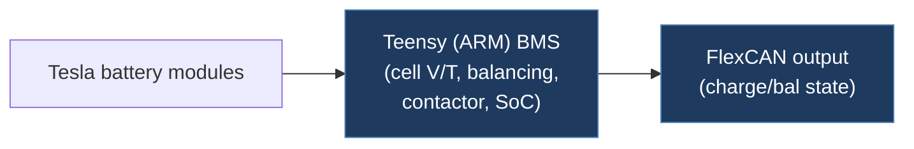

# jomytec-My_TeslaBMS

## Overview

A Battery Management System (BMS) firmware for Teensy (ARM) that manages Tesla battery modules in custom EV or energy storage applications. Handles cell voltage monitoring, balancing, temperature sensing, contactor control, state-of-charge calculation, and CAN bus communication. Based on Simp ECO Engineering's SimpBMS V2 with CAN output additions by joromy.

## Technical Details

- **Platform**: Teensy (ARM Cortex-M4, likely Teensy 3.2/3.5/3.6)
- **Language**: C++ (Arduino)
- **CAN Interface**: FlexCAN (Teensy built-in CAN controller)
- **License**: MIT (per file header from Simp ECO Engineering)

## Architecture

Single file project:

- `TeslaBMS.ino` — Complete BMS firmware containing:
  - `BMSModuleManager` — Manages Tesla battery module communication (likely via serial SPI to Tesla BMS slave boards)
  - `SerialConsole` — CLI interface for configuration and debugging
  - `EEPROMSettings` — Persistent configuration storage with factory defaults
  - `Logger` — Logging subsystem
  - State machine with states: Boot, Ready, Drive, Charge, Precharge, Error, Bat_HC
  - GPIO-based contactor control (negative contactor, precharge relay, HV AUX relay, charge enable)
  - Current sensing via analog input with one-pole low-pass filter (5 Hz)
  - SOC calculation (both current-integration and voltage-based)
  - Cell balancing logic

Key configuration parameters (EEPROM-stored):

- Over/under voltage setpoints (4.2V / 3.0V)
- Charge voltage (4.1V), discharge voltage (3.2V)
- Temperature limits (-10°C to 65°C)
- Cell gap limit (0.2V max delta)
- CAN speed: 500 kbit/s
- Battery capacity: 100 Ah, 12 cells in series

## CAN Bus Integration

- Uses FlexCAN library with extended address filtering enabled (filters 4–15 pass all).
- CAN speed configurable (default 500 kbit/s).
- CAN message structures defined via `CAN_message_t` (FlexCAN standard).
- Supports charger control via CAN (chargertype = 1 for Tesla CAN control).
- Specific CAN message IDs for TX/RX not visible in the portion read, but the architecture supports broadcasting BMS status (voltage, current, SOC, temperature, alarms) over CAN.

## Relevance to Our Project

Relevant for understanding Tesla battery module communication and BMS integration. Not directly related to FSD/autopilot CAN messaging, but useful if the project expands to include battery monitoring.

- **Reusability**: Low
- **Key Takeaways**:
  - Tesla battery module communication protocol (via BMSModuleManager)
  - BMS state machine (Boot → Ready → Drive/Charge/Precharge → Error)
  - Cell balancing algorithm with configurable voltage thresholds and duty cycle
  - EEPROM-based configuration pattern with factory reset
  - Contactor precharge sequence with current threshold check
  - Current-based and voltage-based SOC calculation methods
