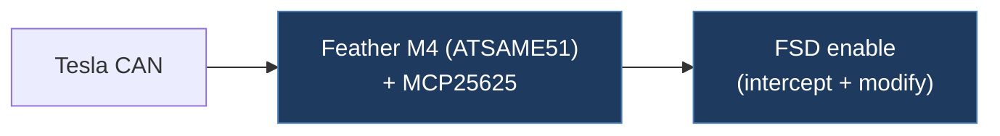

# jvanakker-tesla-fsd-can-mod

## Overview

A mirror of the original Starmixcraft Tesla FSD CAN mod for the Adafruit Feather M4 CAN (MCP25625-based). The firmware intercepts CAN bus messages to enable FSD functionality on Tesla vehicles. Noted as non-functional on Tesla software versions 2026.8.6, 2026.2.9.x and later.

## Architecture

## Technical Details

- **Platform**: Adafruit Feather M4 CAN (ATSAME51 + MCP25625)
- **Language**: C++ (Arduino IDE)
- **CAN Interface**: MCP2515/MCP25625 via SPI at 500 kbps (16 MHz oscillator)
- **License**: GPL v3 (declared in source file header)

## Architecture

Single-file firmware:

- `CanFeather.ino` — Complete firmware implementing three hardware variant handlers as C++ structs with virtual dispatch:
  - `LegacyHandler` — HW3 Retrofit: monitors CAN ID 1006 (0x3EE)
  - `HW3Handler` — HW3 vehicles: monitors CAN IDs 1016 (0x3F8) and 1021 (0x3FD)
  - `HW4Handler` — HW4 vehicles: same CAN IDs as HW3 with extended bit manipulation

Uses `std::unique_ptr<CarManagerBase>` for runtime polymorphism, compile-time selection via `#define HW`.

## CAN Bus Integration

Intercepts and re-transmits CAN frames on the vehicle bus:

- **CAN ID 1006 (0x3EE)** [Legacy]: Mux 0 — reads FSD UI state, sets bit 46 (FSD enable), writes speed profile to byte 6 bits 1-2. Mux 1 — clears bit 19 (nag suppression).
- **CAN ID 1016 (0x3F8)** [HW3/HW4]: Reads follow-distance setting from byte 5 bits 5-7, maps to speed profile.
- **CAN ID 1021 (0x3FD)** [HW3/HW4]: Mux 0 — sets FSD enable (bit 46), speed profile. Mux 1 — nag suppression (bit 19). Mux 2 — speed offset encoding.
- HW4 additionally sets bit 60 and bit 47 for FSD V14 features, and encodes 5-level speed profile in byte 7 bits 4-6.

Wiring: CAN-H/CAN-L to X179 connector pins 13/14. Onboard 120Ω termination resistor must be cut.

## Relevance to Our Project

This is the original single-board Starmixcraft mirror. The `juamiso-tesla-fsd-can-enabler` fork is more complete with multi-board support, but this repo provides the clearest single-file reference of the original CAN mod logic.

- **Reusability**: Medium
- **Key Takeaways**:
  - Clean single-file reference implementation of FSD CAN mod
  - Polymorphic handler pattern for multi-HW-variant support
  - X179 connector wiring details (pins 13/14 for CAN-H/CAN-L)
  - Note: reported broken on newer Tesla firmware (2026.8.x+)
