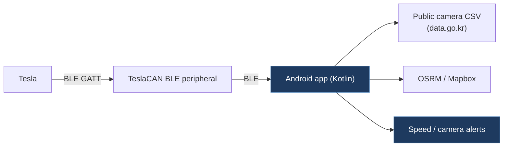

# kangbumhee-TLA-SpeedAlert

## Overview

A Korean-language Android app that connects to a Tesla via BLE to receive speed and GPS data, then provides speed camera and enforcement camera alerts. Uses public camera data (data.go.kr CSV), OSRM/Mapbox routing, and BLE GATT notifications from a "TeslaCAN" BLE peripheral device for real-time speed and position.

## Architecture

## Technical Details

- **Platform**: Android (Kotlin)
- **Language**: Kotlin
- **CAN Interface**: Indirect — connects to a "TeslaCAN" BLE peripheral device (not directly to CAN bus)
- **License**: None (no LICENSE file present)

## Architecture

Android app with Gradle build system:

- `BleService.kt` — BLE foreground service; scans for a device named "TeslaCAN" with service UUID `0000ff01`, subscribes to speed characteristic (`0000ff03`) and GPS characteristic (`0000ff04`) via GATT notifications
- `CameraEngine.kt` — Speed camera alert engine with phase-based alerting (500m/300m/100m), heading-aware scanning, section speed camera support, and cooldown logic
- `CameraDatabase.kt` — Local SQLite database of camera locations loaded from CSV asset files
- `AlertPlayer.kt` — Audio alert playback
- `RouteService.kt` — OSRM/Mapbox route processing
- `MapboxRouter.kt` — Mapbox Directions API integration
- `MainActivity.kt` — Main UI with map display
- `SettingsStore.kt` — Shared preferences for user settings

## CAN Bus Integration

No direct CAN bus integration. The app consumes data from an external BLE device named "TeslaCAN" that presumably reads CAN bus data and exposes speed/GPS over BLE GATT characteristics:

- Service UUID: `0000ff01-0000-1000-8000-00805f9b34fb`
- Speed characteristic: `0000ff03-0000-1000-8000-00805f9b34fb`
- GPS characteristic: `0000ff04-0000-1000-8000-00805f9b34fb`

## Relevance to Our Project

Demonstrates a BLE consumer app that pairs with a Tesla CAN BLE peripheral — the BLE UUIDs match our project's BLE service design. The Android BLE GATT client code is a useful reference for mobile app integration.

- **Reusability**: Medium
- **Key Takeaways**:
  - BLE GATT client connecting to a "TeslaCAN" device with matching UUIDs (ff01/ff03/ff04)
  - Phase-based speed camera alert engine pattern
  - Android foreground service for BLE connectivity
  - Example of a real consumer app built on top of a CAN-to-BLE bridge
