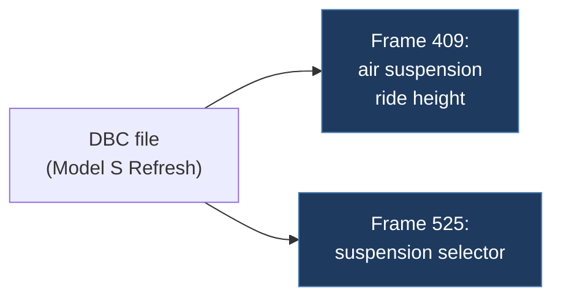

# mcirish-TeslaModelS_RefreshCAN.dbc

## Overview

A placeholder repository for CAN bus signal reverse engineering on Tesla Model S Refresh vehicles. Contains a single DBC file defining two CAN frames: one for air suspension ride height sensors (Frame 409) and one for a suspension-related selector (Frame 525). Very minimal content.

## Architecture

## Technical Details

- **Platform**: N/A (DBC database file only)
- **Language**: DBC format
- **CAN Interface**: N/A
- **License**: None

## Architecture

- `Frame409.dbc` — Single DBC file with two message definitions
- `README.md` — States this is a placeholder for reverse engineering efforts

## CAN Bus Integration

- **CAN ID 409 (0x199)**: Air suspension ride height signals
  - `Height_LF` — Left front ride height (6 bits, offset 40)
  - `Height_RF` — Right front ride height (6 bits, offset 46)
  - `Height_LR` — Left rear ride height (6 bits, offset 52)
  - `Height_RR` — Right rear ride height (6 bits, offset 58)
  - Plus 5 undefined 8-bit signals in bytes 0–4
- **CAN ID 525 (0x20D)**: Suspension ride height selector
  - `Sig352` — 2-bit signal at offset 36 with values: 0=Very_High, 1=High, 2=Medium, 3=Low

## Relevance to Our Project

Limited direct relevance as this targets Model S Refresh air suspension, which is outside our primary focus. However, the ride height CAN signal definitions could be useful if our project expands to Model S support.

- **Reusability**: Low
- **Key Takeaways**:
  - Model S Refresh air suspension ride height signal locations (CAN ID 409)
  - Ride height selector enum values (CAN ID 525)
  - DBC format reference for Tesla signal definitions
