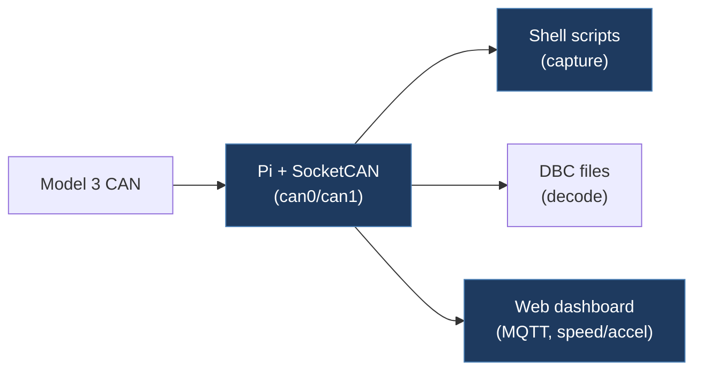

# mhpetiwala-TeslaCAN

## Overview

A fork/mirror of the MatthewDriver-TeslaCAN repository. Contains the same Tesla Model 3 CAN bus logging scripts, DBC files, and MQTT-connected web dashboard for real-time visualization. The file structure and contents are nearly identical to the MatthewDriver version, including the same scripts, DBC files, and HTML dashboard.

## Architecture

## Technical Details

- **Platform**: Raspberry Pi (Linux/SocketCAN)
- **Language**: Bash, Python, JavaScript/HTML
- **CAN Interface**: SocketCAN (can0, can1 at 500kbps)
- **License**: MIT (Copyright 2022 Chuck Cook)

## Architecture

Largely identical to MatthewDriver-TeslaCAN, with some scripts absent:

- `scripts/can_setup.sh` — SocketCAN interface setup
- `scripts/canlogging.sh` — CAN data capture via `candump`
- `scripts/Model3CAN.dbc` — Tesla Model 3 signal definitions
- `scripts/convertbinary.py`, `convertRawASC.py` — Log converters
- `www/index.html` — MQTT + D3.js real-time dashboard
- `SteeringDemo.mp4` — Demo video

> **Note**: `scripts/mqttpy.py` (MQTT publisher) is not present in this fork, unlike in MatthewDriver-TeslaCAN.

## CAN Bus Integration

Same as MatthewDriver-TeslaCAN — uses SocketCAN at 500kbps with DBC-based decoding and MQTT streaming.

## Relevance to Our Project

No additional value beyond what MatthewDriver-TeslaCAN provides, as this appears to be a direct fork/mirror with no meaningful modifications.

- **Reusability**: None (duplicate of MatthewDriver-TeslaCAN)
- **Key Takeaways**:
  - Same content as MatthewDriver-TeslaCAN; refer to that analysis instead
