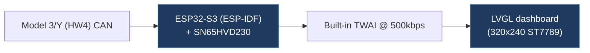

# nicholasyangyang-ESP32-dash-direct

## Overview

An ESP32-S3 based Tesla Model 3/Y (HW4) dashboard that directly reads CAN bus frames via the TWAI peripheral and renders real-time vehicle data on a 320×240 ST7789 LCD using LVGL. No WiFi or network required — displays data immediately on boot.

## Architecture

## Technical Details

- **Platform**: ESP32-S3 (ESP-IDF)
- **Language**: C
- **CAN Interface**: ESP32-S3 built-in TWAI (500 kbps) with external SN65HVD230/TJA1051 transceiver
- **License**: None

## Architecture

- `main/can_direct.c` / `can_direct.h` — TWAI driver init and CAN frame parsing task (Core 0, priority 5). Parses frames into a global `dashboard_state_t` struct.
- `main/ui.c` / `ui.h` — LVGL-based UI rendering at 60 Hz (Core 1). Reads `g_state` and updates LCD via SPI DMA.
- `main/bsp.c` / `bsp.h` — Board support: LCD (ST7789 SPI), I2C (PCA9557 IO expander, FT5x06 touch).
- `main/main.c` — Application entry point.
- `main/lv_font_speed_120.c` — Custom large LVGL font for speed display.
- Lock-free design: `g_state` fields are 32-bit aligned, single-writer/multi-reader.

## CAN Bus Integration

Extensive CAN signal parsing for HW4 Tesla Model 3/Y based on joshwardell/model3dbc DBC and tesla-can-explorer (firmware 2026.2):

| CAN ID | Signal | Data |
| ------ | ------ | ---- |
| 0x257 | DI_speed | Speed (km/h or mph), units flag |
| 0x118 | DI_systemStatus | Gear (P/R/N/D) |
| 0x212 | BMS_status | Charging flag |
| 0x3F5 | VCFRONT_vehicleLights | Low/high beam, turn signals, hazard |
| 0x399 | DAS_status | Autopilot engaged |
| 0x219 | VCSEC_TPMSData | TPMS pressures (4 wheels) |
| 0x33A | UI_range | Range (km/mi), SOC % |
| 0x292 | BMS_socStatus | Backup SOC (0.1% precision) |
| 0x252 | BMS_powerAvailable | Max regen power (kW) |
| 0x334 | UI_powertrainControl | Regen torque limit, stopping mode |

Detailed bit-level decoding documented in README with exact byte/bit offsets.

## Relevance to Our Project

Excellent reference for direct ESP32 TWAI CAN bus decoding of Tesla Model 3/Y HW4 signals. The signal parsing code is well-documented with DBC cross-references and covers a wide range of vehicle data.

- **Reusability**: High
- **Key Takeaways**:
  - Comprehensive HW4 CAN signal map with bit-level decode (0x257, 0x118, 0x212, 0x3F5, 0x399, 0x219, 0x33A, 0x292, 0x252, 0x334)
  - Lock-free dual-core architecture pattern (CAN rx on Core 0, UI on Core 1)
  - ESP-IDF TWAI driver usage patterns
  - LVGL integration for embedded dashboard display
