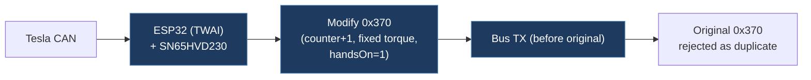

# nicolozak-nag-killer

## Overview

A minimal ESP32-based research firmware that echoes modified CAN ID 0x370 (880, EPAS status) frames with counter-based arbitration. It forces a fixed torque value and sets the handsOn bit to suppress the hands-on-wheel nag warning by transmitting a modified frame before the original, causing the original to be treated as a duplicate.

## Architecture

## Technical Details

- **Platform**: ESP32 (LILYGO T-CAN485)
- **Language**: C (Arduino/ESP-IDF TWAI)
- **CAN Interface**: ESP32 built-in TWAI with SN65HVD230 transceiver at 500 kbps
- **License**: GPL-3.0

## Architecture

Two firmware versions, each in its own subdirectory:

- `v1_simple/v1_simple.ino` — Single-file firmware (~150 lines). Contains all logic:
  - TWAI driver init (GPIO 26 RX, 27 TX, 23 standby, 16 power enable)
  - Main loop: receives CAN frames, filters for ID 0x370, echoes modified copies
  - `echoModified880()` — inline function that modifies and transmits the echo frame
  - Serial interface at 2,000,000 baud with 'e' (toggle echo) and 's' (status) commands
  - Auto-recovery from TWAI BUS_OFF state
  - Heartbeat logging every 5 seconds
- `v2_dashboard/v2_dashboard.ino` + `v2_dashboard/index_html.ino` — Extended version that adds a WiFi web dashboard (real-time EPAS status, stats display); the HTML is embedded in a separate `.ino` file.

## CAN Bus Integration

Targets CAN ID 0x370 (decimal 880) — Tesla EPAS status frame:

**Frame Modification Logic:**

- Byte 3: forced to 0xB6 (fixed torque = 1.80 Nm)
- Byte 4 bit 6: set (handsOnLevel = 1)
- Byte 6 lower nibble: counter incremented by 1 (mod 16)
- Byte 7: checksum recomputed as `(sum(bytes 0..6) + 0x73) & 0xFF`

**Arbitration Strategy:** The modified frame transmits with counter+1 immediately (~8-10 µs latency). When the original frame arrives on the bus with the same counter value, listeners that deduplicate on counter discard the original.

**Decoded EPAS Signals:**

- handsOnLevel: byte 4 bits 7:6 (0-3)
- torsionBarTorque: byte 2 lower nibble << 8 | byte 3, × 0.01 - 20.5 Nm

## Relevance to Our Project

Demonstrates a counter-based CAN frame pre-emption technique for EPAS nag suppression. The checksum algorithm and frame timing approach are directly applicable.

- **Reusability**: Medium
- **Key Takeaways**:
  - CAN 0x370 EPAS status frame structure and checksum algorithm: `(sum(bytes 0..6) + 0x73) & 0xFF`
  - Counter-based arbitration/pre-emption technique for frame replacement
  - Echo latency ~8-10 µs achievable with TWAI
  - LILYGO T-CAN485 pin mapping (GPIO 26/27/23/16)
  - Self-echo detection pattern to avoid feedback loops
