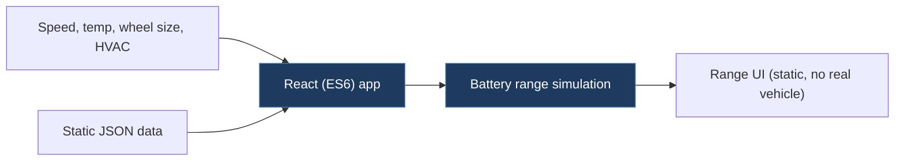

# oliwiah-Tesla_Battery_Range_Calc_React

## Overview

A React web application that simulates Tesla Model 3 battery range calculations based on various parameters (speed, temperature, wheel size, HVAC settings). It is a UI exercise rebuilt in React from Todd Motto's Angular 2 tutorial, using static JSON data — not connected to any real vehicle or CAN bus.

## Architecture

## Technical Details

- **Platform**: Web browser
- **Language**: JavaScript (ES6), React
- **CAN Interface**: N/A
- **License**: None

## Architecture

- `my-app/` — Standard Create React App project structure
  - `src/` — React components implementing a battery range calculator UI
  - `public/` — Static assets
- `package-lock.json` — Dependency lockfile
- `gif.gif` — Demo animation
- Uses Bootstrap for styling and static JSON data for range calculations

## CAN Bus Integration

No direct CAN integration. This is a purely frontend web application that uses pre-defined static data to calculate and display estimated battery range. It does not interact with any vehicle systems.

## Relevance to Our Project

Minimal relevance. This is a UI/React learning project with no CAN bus, vehicle communication, or firmware components.

- **Reusability**: None
- **Key Takeaways**:
  - None directly applicable to CAN bus or firmware work
