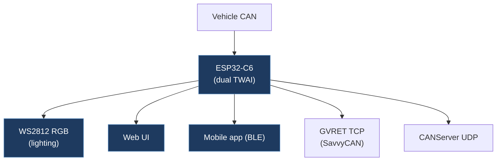

# rafal83-Car-Light-Sync

## Overview

A comprehensive WS2812 RGB LED control system that synchronizes lighting effects with vehicle CAN bus data. Features a web interface, mobile app (BLE), automotive dashboard modes (Park/Drive with speed display, pedal arc, blindspot indicators), OTA updates, and integrated CAN gateways (GVRET TCP for SavvyCAN, CANServer UDP). Supports multi-vehicle CAN integration via dual TWAI channels.

## Architecture

## Technical Details

- **Platform**: ESP32-C6, ESP32-S3 (ESP-IDF 5.2+)
- **Language**: C (ESP-IDF)
- **CAN Interface**: Dual ESP32 TWAI (requires ESP32-C6 for dual TWAI support)
- **License**: Non-Commercial (custom license — commercial use prohibited without written permission)

## Architecture

- `main/` — ESP-IDF application entry (currently stub `app_main()`, main logic likely in `src/`)
- `src/` — Source directory (ESP-IDF `CMakeLists.txt` based project with PlatformIO overlay)
- `data/` — Embedded web assets (HTML, JS, CSS, PNG, JSON config) compressed with gzip
- `vehicle_configs/` — Per-vehicle CAN configuration files
- `presets/` — LED effect presets
- `mobile.app/` — Mobile app (BLE interface)
- `scripts/` — Build tools including HTML compression and version injection
- `tools/` — Build tooling
- `docs/` — Detailed documentation (hardware, software, firmware, troubleshooting)
- `platformio.ini` — Multi-environment build: esp32c6, esp32s3, esp32s3_n4r2, esp32c6_production
- Multiple partition table configs and sdkconfig variants per board

## CAN Bus Integration

Multi-vehicle CAN integration using dual TWAI channels:

- References joshwardell/model3dbc for Tesla Model 3 CAN signals
- References commaai/opendbc for community DBC files
- References Onyx M2 DBC for additional signals
- Integrated GVRET TCP gateway (SavvyCAN compatible)
- Integrated CANServer UDP gateway (comma.ai panda format)
- ESP-NOW for multi-device coordination (master/satellite roles)
- Vehicle-specific CAN configs in `vehicle_configs/` directory
- Park/Drive mode detection from CAN data for dashboard display

## Relevance to Our Project

Provides a well-architected example of ESP-IDF CAN integration with web interface, BLE, and OTA. The dual TWAI channel usage, CAN gateway implementations, and multi-vehicle config pattern are valuable references.

- **Reusability**: Medium
- **Key Takeaways**:
  - Dual TWAI channel setup on ESP32-C6
  - GVRET TCP gateway implementation for SavvyCAN integration
  - CANServer UDP gateway (comma.ai panda format)
  - ESP-NOW multi-device communication pattern
  - Vehicle-specific CAN configuration architecture
  - Embedded web interface with gzip compression and OTA updates
  - Non-commercial license restricts commercial reuse
