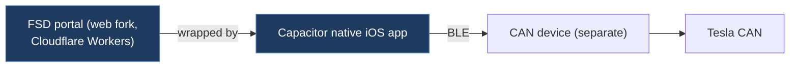

# riderx-autosteerplus

## Overview

A Capacitor + Vue 3 mobile/web application that wraps the FSD activation portal (fsd.teslaandroid.com) into a native iOS app with Bluetooth bridge and a hosted web fork. It provides onboarding, documentation, FAQ flows, and a cleaner UI around the original portal behavior using Konsta UI and Tailwind CSS.

## Architecture

## Technical Details

- **Platform**: iOS (Capacitor native app), Web (Cloudflare Workers)
- **Language**: TypeScript, Vue 3
- **CAN Interface**: N/A (communicates via BLE to a separate CAN device)
- **License**: MIT

## Architecture

- `src/` — Vue 3 application source
  - `features/portal/` — Portal UI components and styles
  - `runtime/` — Bluetooth bridge and session handling
  - `App.vue` — Root component
  - `main.ts` — Application entry
- `capacitor.config.ts` — Capacitor configuration with BLE display strings
- `vite.config.ts` — Vite build configuration
- `wrangler.jsonc` — Cloudflare Workers deployment config for web hosting
- `worker/` / `worker-youtube/` — Cloudflare Worker functions
- `ios/` — iOS native project
- `android/` — Android native project
- `scripts/` — Build/deployment scripts
- `AGENTS.md` — Codex agent instructions

**Two runtime modes:**

1. **Native app**: Capacitor + Web Bluetooth shim via `@capacitor-community/bluetooth-le` for BLE bridge
2. **Web mode**: Plain Vite site on Cloudflare, requires Web Bluetooth compatible browser

## CAN Bus Integration

No direct CAN bus integration. The app communicates via Bluetooth Low Energy (BLE) to a separate hardware device that handles the actual CAN bus interaction. The app serves as a UI/control layer for the FSD activation portal workflow.

## Relevance to Our Project

Provides a reference for building a mobile/web companion app with BLE connectivity to a CAN device. The Capacitor BLE bridge pattern could be useful for our mobile app integration.

- **Reusability**: Low
- **Key Takeaways**:
  - Capacitor + Vue 3 BLE bridge pattern for communicating with CAN hardware
  - Web Bluetooth compatibility shim for cross-platform BLE
  - Cloudflare Workers deployment for web companion app
  - Onboarding/docs/FAQ flow design for end-user-facing Tesla tools
