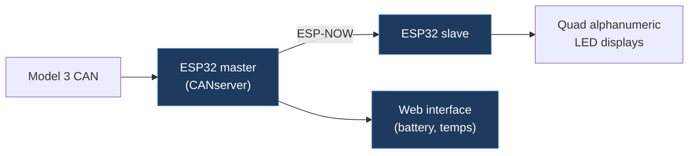

# rossklonowski-CANserver

## Overview

A modified version of Josh Wardell's CANserver that reads Tesla Model 3 CAN bus data on an ESP32, transmits real-time data (battery voltage, current, power) to a slave ESP32 via ESP-NOW, and serves a web interface for viewing additional vehicle telemetry (temperatures, battery life). The slave ESP32 drives quad alphanumeric LED segment displays.

## Architecture

## Technical Details

- **Platform**: ESP32 (dual ESP32 setup — master + slave)
- **Language**: C++ (Arduino)
- **CAN Interface**: CAN bus via CANserver hardware (Josh Wardell's board) at 500 kbps
- **License**: MIT (Copyright 2020 Josh Wardell)

## Architecture

- `CANserver-master/CANserver-master/CANserver/`
  - `CANserver.ino` — Main master firmware: CAN bus reading, ESP-NOW transmission, WiFi AP with web server
  - `carDataVariables.h` — All decoded vehicle data variables (battery, temperatures, power, torques, SOC, etc.)
  - `generalCANSignalAnalysis.h/.cpp` — Library for extracting CAN signals by bit position, length, factor, offset, endianness
  - `sendHelper.h/.cpp` — ESP-NOW data transmission helpers
  - `payload.h` — ESP-NOW payload structure definition
  - `constants.h` — Configuration constants
  - `simulation.h/.cpp` — CAN data simulation mode
  - `AsyncJson.h` — Async JSON for web server
  - `data/` — Web interface (HTML, CSS, fonts)
- `CANserver-master/CANserver-slave/` — Slave ESP32 firmware for driving alphanumeric displays
- `can_common-master/` — Common CAN library
- `esp32_can-master/` — ESP32 CAN driver library
- `tools/` — Utility tools

## CAN Bus Integration

Reads Tesla Model 3 CAN bus at 500 kbps. Decodes extensive vehicle data using `generalCANSignalAnalysis` library:

**Decoded CAN Signals (from carDataVariables.h):**

- Battery: voltage, current, power, nominal/expected energy remaining, full pack energy, energy buffer
- Temperature: battery min/max/avg, front/rear inverter, coolant flow/inlet temps, cabin temp/humidity
- Powertrain: front/rear power, power limits, front/rear torque, SOC average
- Charging: line voltage, current, power
- Regen: max regen, max discharge
- UI: speed, odometer, display state

CAN ID 0x3E6 used for master-slave acknowledgment via ESP-NOW.

## Relevance to Our Project

Useful reference for Tesla Model 3 CAN data decoding and the generalCANSignalAnalysis library pattern for extracting arbitrary bit-positioned signals. The ESP-NOW master/slave architecture demonstrates wireless data distribution.

- **Reusability**: Medium
- **Key Takeaways**:
  - `generalCANSignalAnalysis` library for generic CAN signal extraction (bit position, length, factor, offset, endianness)
  - Comprehensive Tesla Model 3 CAN variable set (battery, temperature, powertrain, charging)
  - ESP-NOW master/slave wireless data distribution pattern
  - Built-in WiFi AP + web server for vehicle data display
  - CAN data simulation mode for development without vehicle
