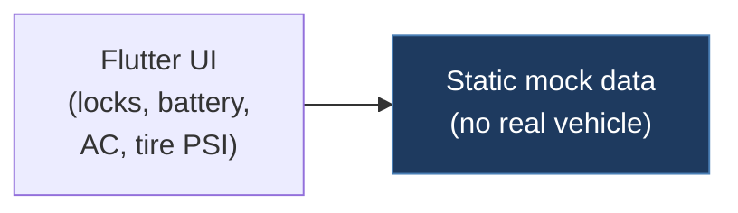

# rrrovalle-tesla-car-app

## Overview

A Flutter-based Tesla car control UI app that simulates door lock/unlock, battery status, air cooler temperature, and tire PSI monitoring. This is purely a front-end UI mockup — it does not communicate with a real Tesla vehicle or any CAN bus.

## Architecture

## Technical Details

- **Platform**: Flutter (Android/iOS/Web)
- **Language**: Dart
- **CAN Interface**: N/A
- **License**: None

## Architecture

- `app/lib/main.dart` — App entry point, sets up dark theme MaterialApp
- `app/lib/home_controller.dart` — State management via ChangeNotifier for door locks and navigation
- `app/lib/screens/home_screen.dart` — Main UI screen
- `app/lib/screens/components/` — UI components
- `app/lib/models/` — Data models
- `app/lib/constraints.dart` — Layout constraints

The app uses Flutter's ChangeNotifier pattern for state management. All data (door locks, battery, temperature, tire PSI) is simulated locally with no backend or vehicle connection.

## CAN Bus Integration

No direct CAN integration. This is a UI-only project that simulates Tesla controls visually. There is no vehicle communication, API calls, or CAN bus interaction.

## Relevance to Our Project

Minimal relevance. This is a visual mockup, not a functional vehicle interface. Could serve as UI inspiration for a companion mobile app, but has no CAN bus or technical overlap.

- **Reusability**: None
- **Key Takeaways**:
  - Flutter dark theme styling for Tesla-branded UI
  - Door lock/unlock state management pattern
