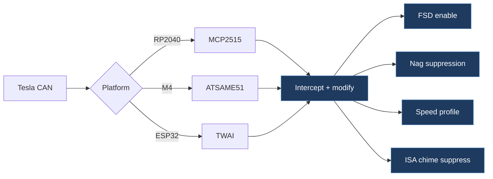

# sahilcc7-tesla_can

## Overview

This is the upstream open-source Tesla CAN mod firmware (Tesla Open Can Mod) that our project is derived from. It runs on Adafruit Feather RP2040 CAN, Feather M4 CAN Express, or ESP32 boards to intercept and modify CAN bus messages for enabling FSD, speed profile control, nag suppression, and ISA speed chime suppression on Tesla vehicles.

## Architecture

## Technical Details

- **Platform**: Adafruit Feather RP2040 CAN (MCP2515), Feather M4 CAN Express (ATSAME51), ESP32 (TWAI)
- **Language**: C++ (Arduino framework)
- **CAN Interface**: MCP2515 (SPI), ATSAME51 native CAN, ESP32 TWAI — all at 500 kbps
- **License**: GPL-3.0

## Architecture

- `RP2040CAN.ino` — Arduino IDE entry point with board/vehicle `#define` selections
- `src/main.cpp` — PlatformIO entry point, delegates to `app.h`
- `include/app.h` — Core application logic (`appSetup`, `appLoop`)
- `include/drivers/` — Hardware abstraction layer:
  - `mcp2515_driver.h` — MCP2515 SPI driver
  - `same51_driver.h` — ATSAME51 native CAN driver
  - `twai_driver.h` — ESP32 TWAI driver
- `platformio.ini` — PlatformIO build configs for all three hardware targets plus native test environment
- `scripts/platformio_sync_ino_defines.py` — Syncs `#define` settings from the .ino file to PlatformIO builds

Supports three vehicle hardware variants:

| Variant | CAN IDs | Features |
| --------- | --------- | ---------- |
| LEGACY (HW3 retrofit) | 1006, 69 | FSD enable, speed profile via follow distance |
| HW3 | 1016, 1021 | Same as legacy, different CAN IDs |
| HW4 | 1016, 1021 | Extended 5-level speed profile range |

## CAN Bus Integration

Deep CAN bus integration — this is the core function of the project:

**Legacy (HW3 Retrofit):**

- `0x045` (69) STW_ACTN_RQ — Reads follow-distance stalk position
- `0x3EE` (1006) mux 0 — Reads FSD state, sets bit 46 (FSD enable), writes speed profile to byte 6 bits 1–2
- `0x3EE` (1006) mux 1 — Clears bit 19 (nag suppression)

**HW3:**

- `0x3F8` (1016) UI_driverAssistControl — Reads follow-distance setting
- `0x3FD` (1021) UI_autopilotControl mux 0 — FSD enable bit, speed profile
- `0x3FD` (1021) UI_autopilotControl mux 1 — Nag suppression
- `0x3FD` (1021) UI_autopilotControl mux 2 — Speed offset

**HW4:** Same CAN IDs as HW3 with extended speed-profile range (5 levels).

Additional features: ISA speed chime suppression, emergency vehicle detection.

## Relevance to Our Project

This is the direct upstream of our project's firmware. Our `firmware/` directory is essentially this codebase with our modifications.

- **Reusability**: High
- **Key Takeaways**:
  - Multi-platform driver abstraction (MCP2515/SAME51/TWAI)
  - CAN message interception and modification pattern
  - Vehicle variant handling via compile-time defines
  - CRC/counter management for modified messages
  - PlatformIO + Arduino IDE dual build system
