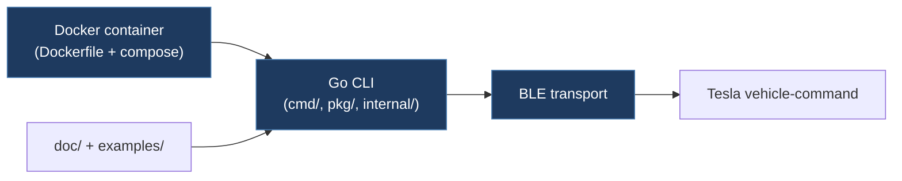

# sethterashima/vehicle-command

**Submodule:** `legacy/sethterashima-vehicle-command`
**URL:** https://github.com/sethterashima/vehicle-command
**License:** Apache-2.0
**Language:** Go

## Overview

Fork of Tesla's official `vehicle-command` by Seth Terashima. Provides a Dockerized environment for issuing commands to Tesla vehicles via BLE. This fork includes pre-built Docker containers for easy deployment.

## Architecture



sethterashima-vehicle-command/
├── cmd/              # CLI command entry points
├── pkg/              # Shared protocol packages
├── internal/         # Internal implementation
├── doc/              # Documentation
├── examples/         # Usage examples
├── Dockerfile        # Docker build
├── docker-compose.yml
├── Makefile
├── go.mod/go.sum     # Go dependencies
└── check-all.sh      # Validation script
```

## Key Components

- **BLE Protocol:** Implements Tesla vehicle command protocol over BLE
- **gRPC Services:** Uses gRPC for service communication
- **Docker Support:** Pre-configured Dockerfile and docker-compose for containerized deployment

## Comparison with TeslaCANModder

| Aspect | sethterashima/vehicle-command | TeslaCANModder |
|--------|-------------------------------|----------------|
| Transport | BLE | CAN bus (MCP2515) |
| Control | Vehicle commands (lock, climate, etc.) | FSD/nag suppression, CAN injection |
| Interface | gRPC/BLE | Serial/WiFi/BLE REST API |
| Target | Tesla API commands | Autopilot CAN modification |

## Relevant Files

- `pkg/` — Protocol implementation reference
- `cmd/` — CLI structure for command dispatch
- `doc/` — Protocol documentation