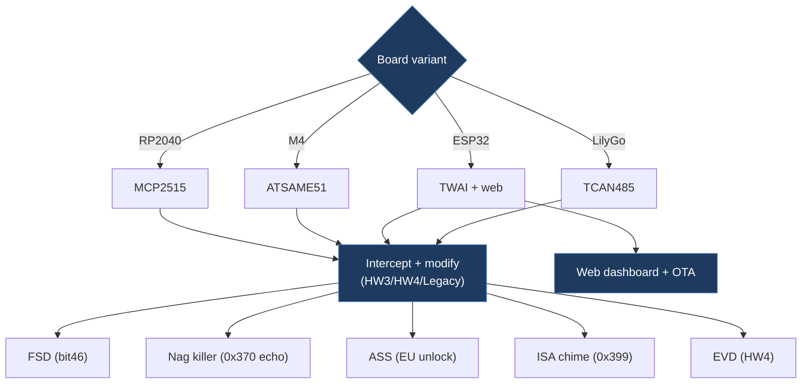

# slxslx-tesla-open-can-mod-slx-repo

**Source:** [gitlab.com/slxslx/tesla-open-can-mod-slx-repo](https://gitlab.com/slxslx/tesla-open-can-mod-slx-repo)  
**License:** GPL-3.0  
**Platform:** PlatformIO (ESP32 TWAI, RP2040, Feather M4, M5Stack, LilyGo TCAN485)

## Overview

Production-quality multi-board Tesla CAN mod with the widest hardware support in the community. Supports 8+ board variants via a unified PlatformIO build. Features a web dashboard (ESP32), OTA updates, and comprehensive CAN signal handling.

## Architecture

## Key Features

- FSD Activation (bit46) — HW3/HW4/Legacy
- Nag Killer (EPAS 0x370 echo method)
- Actually Smart Summon (ASS) — removes EU regulatory restrictions
- ISA Speed Chime Suppression (HW4, 0x399)
- Emergency Vehicle Detection (HW4)
- Speed Profiles (5 levels HW4, 3 levels HW3/Legacy)
- Web Interface with WiFi control (ESP32 variants)
- OTA firmware updates

## CAN IDs

| ID | Hex | Signal | Usage |
| -- | --- | ------ | ----- |
| 1006 | 0x3EE | Legacy autopilot | FSD enable (Legacy) |
| 1016 | 0x3F8 | Follow distance | Speed profile |
| 1021 | 0x3FD | Autopilot control | FSD enable (HW3/HW4) |
| 880 | 0x370 | EPAS status | Nag killer target |
| 920 | 0x398 | GTW carConfig | HW version detect |
| 921 | 0x399 | ISA speed | Chime suppression |

## Hardware Support

| Board | CAN Interface | Notes |
| ----- | ------------ | ----- |
| Adafruit Feather RP2040 CAN | MCP2515 SPI | Default target |
| Adafruit Feather M4 CAN Express | ATSAME51 native | Fast native CAN |
| ESP32 (generic) | TWAI native | WiFi + web dashboard |
| ESP32 Feather V2 | MCP2515 SPI | WiFi + external CAN |
| LilyGo TCAN485 | ESP32 TWAI | Custom pin mapping |
| M5Stack Atomic CAN Base | CA-IS3050G via TWAI | Compact form factor |
| M5Stack AtomS3 Mini CAN | TWAI | Smallest option |
| ESP32-S3 + MCP2515 | SPI (8MHz crystal) | External transceiver |

## Relevance

- **HIGH**: Multi-board PlatformIO strategy, MCP2515 8MHz crystal support
- Architecture reference for supporting diverse hardware
- Web dashboard patterns for WiFi-enabled builds
