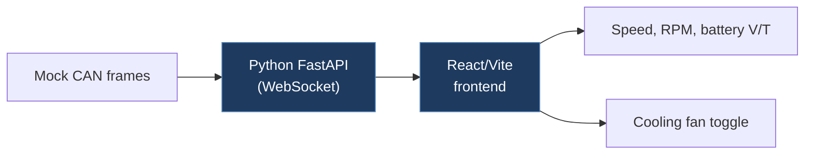

# stylylsty-TelemetryX

## Overview

A full-stack vehicle telemetry dashboard simulating Tesla Service Mode. It uses a Python/FastAPI backend that generates mock CAN frames via WebSocket and a React/Vite frontend that visualizes speed, RPM, battery voltage, temperature, and allows toggling a cooling fan with real-time feedback.

## Architecture

## Technical Details

- **Platform**: PC (Web application)
- **Language**: Python (backend), JavaScript/React (frontend)
- **CAN Interface**: N/A (simulated CAN frames only)
- **License**: None

## Architecture

- `server.py` — FastAPI WebSocket server that receives fan toggle commands and streams decoded CAN data as JSON
- `mock_car.py` — `MockCar` class that simulates vehicle physics (speed, RPM, battery temp, voltage) and generates fake CAN frames with IDs 0x101 (motor) and 0x201 (battery)
- `dashboard/` — React/Vite frontend with Recharts for graph visualization and Tailwind CSS
- `assets/` — Screenshots

**Backend flow:**

1. `MockCar.generate_can_frame()` simulates physics (speed ±5, RPM proportional, temp drift)
2. Generates hex-encoded CAN frame data with simulated IDs
3. Server decodes frames using bitwise operations (big-endian byte extraction)
4. Sends decoded JSON to frontend via WebSocket at ~20Hz

**Frontend:** React dashboard with real-time charts for speed, RPM, voltage, temperature, and a fan toggle button.

## CAN Bus Integration

No direct CAN integration. The project simulates CAN frames in software:

- `0x101` — Motor frame: speed (2 bytes), RPM (2 bytes)
- `0x201` — Battery frame: temperature (1 byte, offset +40), voltage (2 bytes), fan status (1 byte)

The CAN IDs used (0x101, 0x201) are arbitrary and do not correspond to real Tesla CAN IDs. The decoding demonstrates basic bitwise extraction patterns (big-endian, shift/mask).

## Relevance to Our Project

Limited direct relevance since it uses simulated data with non-standard CAN IDs. However, the WebSocket telemetry dashboard pattern could inspire a real-time monitoring UI for our project.

- **Reusability**: Low
- **Key Takeaways**:
  - FastAPI + WebSocket pattern for real-time CAN data streaming
  - React dashboard with Recharts for vehicle telemetry visualization
  - Bidirectional WebSocket for both telemetry and control commands
  - Mock CAN frame generation pattern (useful concept for testing)
