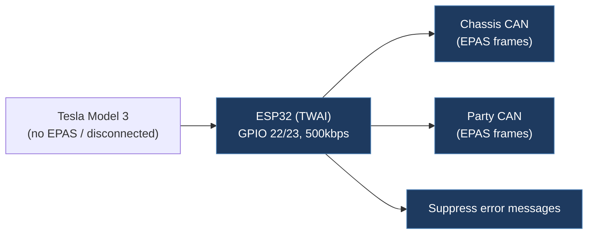

# sydneyg007-Tesla-Model-3-EPAS-emulator

## Overview

ESP32-based CAN bus emulators that replicate the messages sent by the Tesla Model 3 EPAS (Electric Power-Assisted Steering) module on both the Chassis CAN bus and Party CAN bus. Designed for a 2019 Tesla Model 3 Performance, these emulators prevent error messages when the EPAS module is disconnected or replaced.

## Architecture

## Technical Details

- **Platform**: ESP32
- **Language**: C++ (Arduino)
- **CAN Interface**: ESP32 built-in CAN (TWAI) via `esp32_can.h` library, TX: GPIO 22, RX: GPIO 23, 500 kbps
- **License**: None

## Architecture

Two separate Arduino sketches — one per CAN bus:

### ESP32CanbusEmulatorChassisCanEpasV2

Emulates EPAS messages on the **Chassis CAN bus**:

- `0x31` — 3 bytes, 10ms cycle, CRC + counter (0x50–0x5F) with lookup table
- `0x51` — 3 bytes, 10ms cycle, CRC + counter (0x60–0x6F) with lookup table
- `0x52` — 8 bytes, 10ms cycle, counter (0x20–0x2F) + checksum (counter + powerTrace + 0x16)
- `0x370` — 8 bytes, 10ms cycle, counter (0x00–0x0F) + checksum (counter + 0x20)
- `0x391` — 8 bytes, 1000ms cycle, matrix index (0x00–0x02)
- `0x3D1` — 8 bytes, 1000ms cycle, static data

### ESP32CanbusEmulatorPartyCanEpasV2

Emulates EPAS messages on the **Party CAN bus**:

- `0x31` — 3 bytes, 10ms cycle, same CRC/counter pattern as chassis
- `0x51` — 3 bytes, 10ms cycle, same CRC/counter pattern as chassis
- `0x370` — 8 bytes, 10ms cycle, counter (0x20–0x2F) + checksum (counter + 0x1E)
- `0x331` — 8 bytes, 1000ms cycle, EPAS3P_info with multiple sub-frames (ASSYID, APP_CRC, UDS_PROTOCOL, BUILD_HWID)
- `0x392` — 8 bytes, 1000ms cycle, matrix index

## CAN Bus Integration

Extensive direct CAN integration. Sends precisely timed EPAS emulation frames:

| CAN ID | Bus | Cycle | Purpose |
| --- | --- | --- | --- |
| 0x31 | Chassis + Party | 10ms | EPAS status with CRC lookup table |
| 0x51 | Chassis + Party | 10ms | EPAS status with CRC lookup table |
| 0x52 | Chassis only | 10ms | Steering power trace data |
| 0x370 | Chassis + Party | 10ms | EPAS counter/checksum frame |
| 0x331 | Party only | 1000ms | EPAS3P_info (PCB ID, app CRC, UDS protocol, HW ID) |
| 0x391 | Chassis only | 1000ms | EPAS3S matrix index |
| 0x392 | Party only | 1000ms | EPAS3P matrix index |
| 0x3D1 | Chassis only | 1000ms | Static EPAS data |

Key patterns: CRC lookup tables for 0x31 and 0x51 (16-entry tables), rolling counters with computed checksums, multi-frame 0x331 with different sub-indexes (0x0B, 0x0D, 0x14, 0x0A).

## Relevance to Our Project

Valuable reference for Tesla CAN bus message timing, CRC patterns, and ECU emulation techniques. The CRC lookup tables and counter/checksum patterns are directly useful for understanding Tesla's CAN message authentication.

- **Reusability**: Medium
- **Key Takeaways**:
  - CRC lookup tables for CAN IDs 0x31 and 0x51 (Tesla EPAS messages)
  - Counter/checksum computation patterns used by Tesla ECUs
  - Chassis vs Party CAN bus message separation
  - 10ms and 1000ms frame timing patterns
  - ESP32 built-in CAN (TWAI) initialization at 500 kbps
  - Multi-frame info message pattern (0x331 with matrix sub-index)
