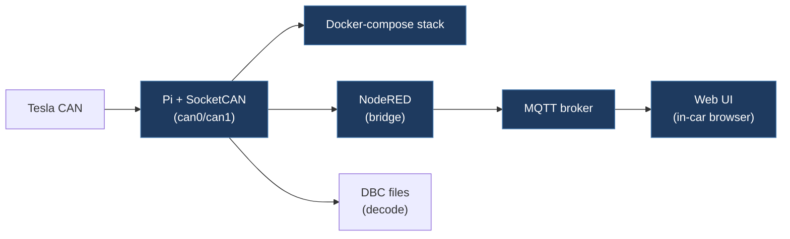

# tesberry-tesberry

## Overview

A Raspberry Pi-based Tesla CAN bus utility that provides a Docker-compose stack for reading/writing CAN bus data, bridging it to MQTT, and exposing a web UI accessible from the Tesla in-car browser. It decodes CAN messages using DBC files and enables bidirectional CAN communication through NodeRED and MQTT.

## Architecture

## Technical Details

- **Platform**: Raspberry Pi (32-bit OS Lite)
- **Language**: Python (bridge), JavaScript (UI, NodeRED)
- **CAN Interface**: SocketCAN (can0, can1 — dual bus support)
- **License**: None

## Architecture

Docker Compose stack with these services:

- `packages/bridge/` — Python CAN-to-MQTT bridge using `python-can`, `cantools`, and `paho-mqtt`. Reads DBC file, decodes CAN frames, publishes to MQTT, and writes CAN messages received via MQTT
- `packages/ui/` — Web interface for the Tesla browser
- `packages/carplay/` — CarPlay integration
- `packages/savvycan-mqtt/` — SavvyCAN MQTT debug bridge
- Mosquitto MQTT broker, NodeRED rule engine, and Portainer for container management
- Network routing to expose the UI via a public IP for the Tesla browser

## CAN Bus Integration

Direct SocketCAN integration at 500 kbps on dual buses (can0, can1 for vehicle and chassis). Uses `cantools` with `Model3CAN.dbc` for message decoding/encoding. The bridge:

- Reads all CAN frames from the bus and decodes them using the DBC
- Publishes decoded values to MQTT topics (`tesberry/{bus}/{message}`)
- Listens on MQTT `tesberry/+/+/SET` topics to encode and send CAN messages back to the bus
- Caches last-seen message data to merge partial updates before sending
- Note: Messages with checksums cannot be easily written; UI-related values without checksums are writable

## Relevance to Our Project

Demonstrates a complete CAN-to-MQTT pipeline with bidirectional communication, web UI accessible from the Tesla browser, and dual-bus support.

- **Reusability**: Medium
- **Key Takeaways**:
  - CAN-to-MQTT bridge pattern using `python-can` + `cantools` + DBC files
  - Dual-bus architecture (vehicle CAN + chassis CAN)
  - Clever network routing to make a local Pi accessible from the Tesla browser
  - Docker Compose-based service orchestration is a good deployment model
  - Acknowledges that checksum-protected messages cannot be trivially rewritten
