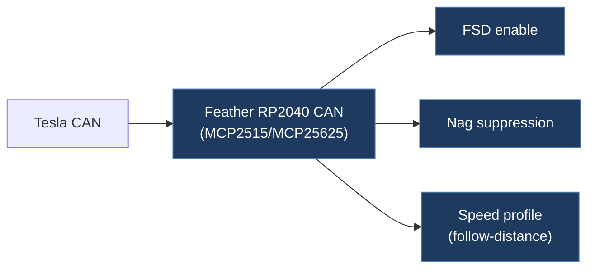

# tesla-fsd-can-mod-main

## Overview

The original single-file Tesla FSD CAN bus enabler firmware targeting the Adafruit Feather RP2040 CAN board. It intercepts autopilot-related CAN frames and modifies specific bits to enable FSD, suppress nag warnings, and map follow-distance settings to speed profiles. This is the simpler predecessor to tesla-fsd-can-mod-2-main.

## Architecture

## Technical Details

- **Platform**: Adafruit Feather RP2040 CAN (MCP25625/MCP2515)
- **Language**: C++ (Arduino)
- **CAN Interface**: MCP2515 over SPI
- **License**: GPL-3.0 (stated in source header)

## Architecture

Single-file sketch:

- `CanFeather.ino` — All logic in one file. Contains the same polymorphic handler pattern as tesla-fsd-can-mod-2-main: `CarManagerBase` base struct with `LegacyHandler`, `HW3Handler`, `HW4Handler` derived structs
- Hardware selection via `#define HW HW3` at top of file
- Uses `std::unique_ptr<MCP2515>` for CAN controller management
- Pin definitions reference RP2040 Feather board-specific defines (`PIN_CAN_CS`, `PIN_CAN_INTERRUPT`, etc.)

## CAN Bus Integration

Identical CAN logic to tesla-fsd-can-mod-2-main (this is the earlier version):

- Legacy: Monitors CAN ID 1006, modifies FSD enable bit and speed profile
- HW3: Monitors CAN IDs 1016 (follow-distance) and 1021 (autopilot control)
- HW4: Same as HW3 with extended features
- All at 500 kbps, polling mode (interrupt pin unused)
- Bit manipulation helpers: `readMuxID()`, `isFSDSelectedInUI()`, `setSpeedProfileV12V13()`, `setBit()`

## Relevance to Our Project

The original FSD enabler that spawned the broader open-source CAN mod movement. Simpler than later versions but contains the core logic.

- **Reusability**: Medium (superseded by tesla-fsd-can-mod-2-main and tesla-open-can-mod-main)
- **Key Takeaways**:
  - Demonstrates the minimal viable FSD enabler in a single Arduino sketch
  - Clean, readable bit-level CAN manipulation code
  - Good reference for understanding the evolution of the project
  - RP2040-only target — no multi-platform support yet
