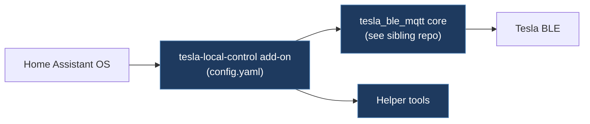

# tesla-local-control/tesla-local-control-addon

**Submodule:** `legacy/tesla-local-control-tesla-local-control-addon`
**URL:** https://github.com/tesla-local-control/tesla-local-control-addon
**License:** Apache-2.0
**Language:** YAML (Home Assistant Add-on)

## Overview

Home Assistant Community Add-on for Tesla BLE MQTT integration. Provides a one-click installation of the tesla_ble_mqtt stack within Home Assistant OS.

## Architecture



```
tesla-local-control-addon/
├── tesla_ble_mqtt/           # Add-on configuration
│   ├── config.yaml           # HA add-on config
│   ├── Dockerfile            # Add-on container
│   └── ...
├── tools/                    # Helper tools
├── repository.yaml           # Add-on repository metadata
├── CHANGELOG.md
└── README.md
```

## Key Features

- **One-click Install:** Home Assistant Supervisor add-on
- **Auto-Discovery:** Integrates with tesla_ble_mqtt_core for HA discovery
- **Docker-based:** Runs as isolated container within HA
- **Configuration UI:** YAML-based configuration through HA UI

## Integration with tesla-local-control Ecosystem

```
tesla-local-control-addon
    └── tesla_ble_mqtt_docker
            └── tesla_ble_mqtt_core
                    └── Tesla Vehicle (BLE)
                            |
                            v
                    MQTT Broker (Home Assistant)
```

## Comparison with TeslaCANModder

| Aspect | tesla-local-control-addon | TeslaCANModder |
|--------|---------------------------|----------------|
| Platform | Home Assistant OS | ESP32 standalone |
| Transport | BLE | CAN + BLE |
| Control | Vehicle commands | CAN injection/FSD |
| Deployment | Add-on store | Manual firmware flash |

## Key Files

- `tesla_ble_mqtt/config.yaml` — Add-on configuration schema
- `repository.yaml` — HA repository metadata