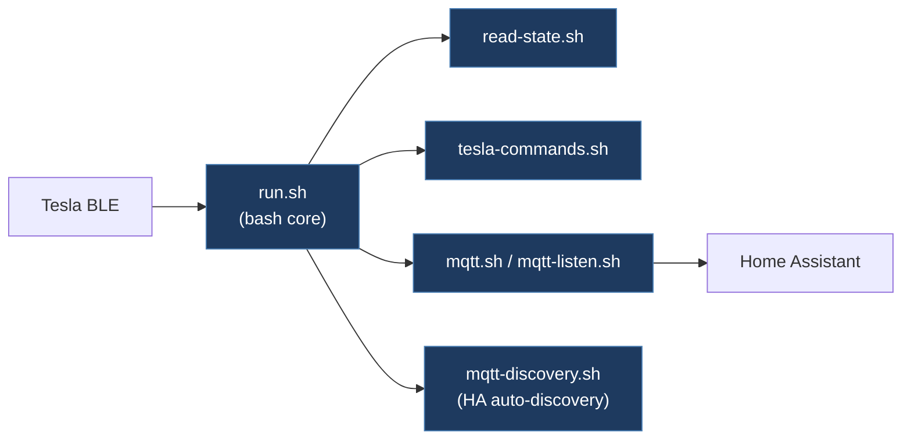

# tesla-local-control/tesla_ble_mqtt_core

**Submodule:** `legacy/tesla-local-control-tesla_ble_mqtt_core`
**URL:** https://github.com/tesla-local-control/tesla_ble_mqtt_core
**License:** Apache-2.0
**Language:** Shell (bash)

## Overview

Core shell scripting library for Tesla BLE to MQTT bridging. Enables Home Assistant integration by exposing Tesla vehicle state and commands via MQTT. Part of the tesla-local-control ecosystem.

## Architecture



```
tesla_ble_mqtt_core/
├── mqtt.sh               # MQTT connection management
├── mqtt-listen.sh        # MQTT subscription listener
├── mqtt-discovery.sh     # Home Assistant auto-discovery
├── mqtt-discovery-sensors.sh
├── tesla-commands.sh     # Tesla command implementations
├── read-state.sh         # Vehicle state reading
├── run.sh                # Main entry point
├── subroutines.sh        # Shared utility functions
├── env.sh                # Environment configuration
├── version.sh            # Version info
├── bluetoothctl-file     # Bluetooth pairing data
├── documentation/       # Additional docs
├── tests/                # Test suite
└── .githooks/           # Git hooks
```

## Key Features

- **MQTT Bridge:** Bidirectional communication between Tesla BLE and MQTT broker
- **Home Assistant Integration:** Auto-discovery for sensors and switches
- **Shell-based:** No compiled dependencies, runs on Linux/router hardware
- **State Management:** Publishes vehicle state to MQTT topics
- **Command Execution:** Receives MQTT commands and executes via BLE

## MQTT Topics

- `tesla/{vin}/state/` — Vehicle state (SOC, temperature, etc.)
- `tesla/{vin}/command/` — Incoming commands
- `tesla/{vin}/response/` — Command responses

## Comparison with TeslaCANModder

| Aspect | tesla_ble_mqtt_core | TeslaCANModder |
|--------|--------------------|--------------------|
| Transport | BLE only | CAN bus + BLE + WiFi |
| Integration | MQTT/Home Assistant | Direct CAN modification |
| Focus | State telemetry + commands | Autopilot CAN manipulation |
| Hardware | Linux/BLE adapter | ESP32 + MCP2515 |

## Relevant Files

- `tesla-commands.sh` — Command implementation reference
- `mqtt-discovery.sh` — HA auto-discovery patterns
- `read-state.sh` — State decoding logic