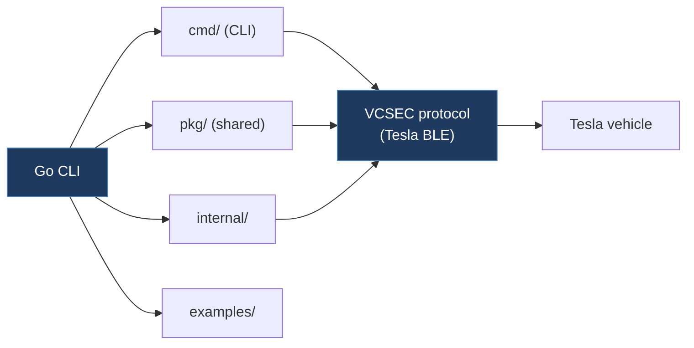

# tesla-local-control/vehicle-command-seth

**Submodule:** `legacy/tesla-local-control-vehicle-command-seth`
**URL:** https://github.com/tesla-local-control/vehicle-command-seth
**License:** Apache-2.0
**Language:** Go

## Overview

Fork of Tesla's official `vehicle-command` by Seth Terashima under tesla-local-control org. A minimal fork with focus on core functionality without doc/ directory.

## Architecture



```
vehicle-command-seth/
├── cmd/                # CLI command implementations
├── pkg/                # Shared protocol packages
├── internal/           # Internal packages
├── examples/           # Usage examples
├── Makefile
├── go.mod/go.sum
└── check-all.sh
```

## Key Characteristics

- **Minimal Fork:** No doc/ directory (unlike upstream)
- **Core Focus:** CLI tools only
- **Lightweight:** No docker-compose or Dockerfile

## Comparison with Related Repos

| Repo | Docker | Docs | Linting |
|------|--------|------|---------|
| teslamotors/vehicle-command | No | Yes | No |
| tesla-local-control/vehicle-command | Yes | Yes | Yes |
| tesla-local-control/vehicle-command-seth | No | No | No |
| sethterashima/vehicle-command | Yes | Yes | No |

## Relevant Files

- `cmd/` — CLI entry points (key reference)
- `pkg/` — Protocol packages