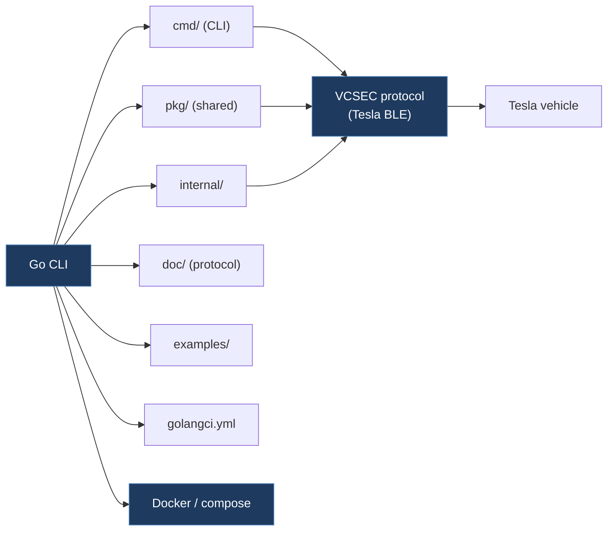

# tesla-local-control/vehicle-command

**Submodule:** `legacy/tesla-local-control-vehicle-command`
**URL:** https://github.com/tesla-local-control/vehicle-command
**License:** Apache-2.0
**Language:** Go

## Overview

Fork of Tesla's official `vehicle-command` by tesla-local-control. Adds linting configuration (golangci.yml) and integration into the tesla-local-control ecosystem for Docker deployment.

## Architecture



```
tesla-local-control-vehicle-command/
├── cmd/                # CLI command implementations
├── pkg/                # Shared protocol packages
├── internal/           # Internal packages
├── doc/                # Protocol documentation
├── examples/           # Usage examples
├── Dockerfile
├── docker-compose.yml
├── Makefile
├── .golangci.yml       # Linting configuration
├── go.mod/go.sum
└── check-all.sh
```

## Key Differences from Official

- Added `.golangci.yml` for code quality enforcement
- Pre-configured for Docker Compose deployment
- Part of tesla-local-control integration stack

## Comparison with TeslaCANModder

| Aspect | tesla-local-control/vehicle-command | TeslaCANModder |
|--------|------------------------------------|----------------|
| Transport | BLE | CAN bus (MCP2515) |
| Focus | Vehicle commands via gRPC | FSD/autopilot CAN modification |
| Deployment | Docker | ESP32 firmware |

## Relevant Files

- `pkg/` — Protocol package structure
- `.golangci.yml` — Code quality config
- `docker-compose.yml` — Deployment reference