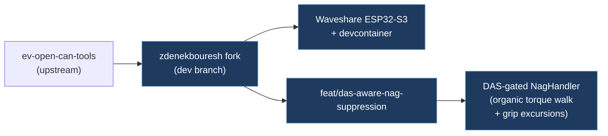

# zdenekbouresh / ev-open-can-tools

## Overview

Fork of `ev-open-can-tools/ev-open-can-tools`. The default branch (`dev`) tracks upstream closely with minor additions (Waveshare ESP32-S3 board support, devcontainer). The `feat/das-aware-nag-suppression` branch is the research-relevant branch — it replaces the upstream's simple always-echo `NagHandler` with a DAS-gated version that adds organic torque variation.

Submodule is on `dev` branch (HEAD = upstream main equivalent).

## Architecture



## Technical Details

- **Platform**: Same as upstream ev-open-can-tools (ESP32, RP2040, M4)
- **Language**: C++ (PlatformIO)
- **License**: GPL-3.0

## feat/das-aware-nag-suppression Branch

This branch contains the key research contribution: a `NagHandler` that gates echo on `DAS_autopilotHandsOnState` from CAN 921 and adds organic torque variation.

### DAS Gating

The upstream `NagHandler` echoes whenever `handsOnLevel == 0`, which fires ~25 frames/s during normal AP driving even when no nag is pending. This branch adds a second filter frame:

```
Filters: CAN IDs 880 (EPAS3P_sysStatus), 921 (DAS_status)
```

From CAN 921: `dasHandsOnState = (data[5] >> 2) & 0x0F`

Echo is suppressed when `dasHandsOnState == 0` (NOT_REQD) or `dasHandsOnState == 8` (SUSPENDED). Echo fires for all other states (1-7, 9-10, 15=SNA fallback). This eliminates spurious injection during satisfied AP driving.

### Organic Torque Variation

Replaces the fixed 1.80 Nm with a random walk + periodic grip excursion:

```
Normal walk range:  raw 2150–2290  ≈  1.00–2.40 Nm  (light resting touch)
Grip excursion:     raw 2350 ± 20  ≈  3.10–3.30 Nm  (brief grip pulse)
Excursion timing:   every 125–225 frames ≈ 5–9 s at 25 Hz
Excursion duration: 3–5 frames ≈ 120–200 ms
```

PRNG: xorshift32 seeded at `0xDEADBEEF`. Walk step: ±15 raw units per frame (±0.15 Nm per 40 ms).

### Frame Encoding (this branch)

Torque encoding uses Motorola 19|12@0+ layout:
- `data[2]` lower nibble = `torqRaw >> 8`
- `data[3]` = `torqRaw & 0xFF`
- `data[4]` |= `0x40` (handsOnLevel = 1)
- `data[6]` lower nibble = counter + 1 (mod 16)
- `data[7]` = `(sum(b0..b6) + 0x73) & 0xFF`

Raw encoding: `tRaw = (Nm + 20.5) / 0.01` — e.g. 1.80 Nm → 0x08B6 (2230 decimal).

### Comparison with Our nag.h

| Aspect | This branch | Our nag.h natural mode |
|--------|-------------|------------------------|
| DAS gate source | CAN 921 `DAS_status` | CAN 880 byte 5 bits[5:2] (same signal, different frame) |
| Normal torque range | 1.00–2.40 Nm | 0.08–0.18 Nm |
| Grip excursion | 3.10–3.30 Nm, 5–9 s interval | Not implemented |
| Torque variation method | xorshift32 random walk | Box-Muller Gaussian |
| Counter byte | byte 6 lower nibble | byte 1 lower nibble |

**Key finding**: Our natural mode torque range (0.08–0.18 Nm) is an order of magnitude smaller than what this branch and the linuchoicoegwangsu guides specify (1.0–2.4 Nm). This is likely insufficient to satisfy DAS on newer firmware.

## Relevance to Our Project

- **Reusability**: High for the DAS-gated echo pattern and organic torque range
- **Key Takeaways**:
  - DAS gating from CAN 921 eliminates ~25 spurious echoes/s during normal AP driving
  - Torque range 1.0–2.4 Nm with 3.1–3.3 Nm grip excursions is the community-validated effective range
  - xorshift32 random walk is simpler and more predictable than Box-Muller Gaussian for this use case
  - Grip excursion pattern (brief high-torque pulses every 5–9 s) mimics natural grip tightening
