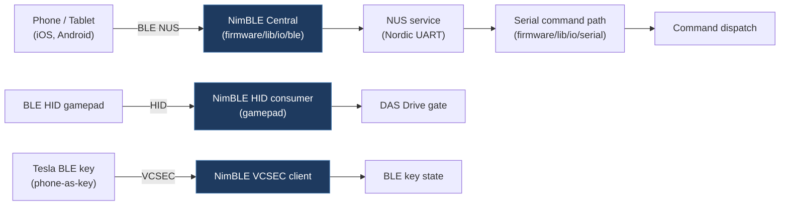

---
title: Bluetooth (BLE)
title_tr: Bluetooth (BLE)
description: NimBLE Bluetooth Low Energy setup and UART service
category: reference
folder: reference
tags: [ble, bluetooth, adapter]
order: 9
icon: 📶
---

# Bluetooth Low Energy (BLE)

ESP32 firmware envs with BLE enabled (any env containing `_ble`, e.g. `esp32_ble_chassis_8mhz`, `esp32_wifi_ble_chassis_vehicle_body_8mhz`) use **NimBLE** for Bluetooth Low Energy communication. This works natively with iOS and Android — no pairing PIN required.



## Overview

| Property           | Value                          |
| ------------------ | ------------------------------ |
| Device Name        | `TeslaCANModder`               |
| Protocol           | BLE GATT (Nordic UART Service) |
| Library            | NimBLE-Arduino                 |
| iOS Compatible     | Yes                            |
| Android Compatible | Yes                            |
| Simultaneous WiFi  | Yes                            |

## Nordic UART Service (NUS)

TeslaCANModder uses the Nordic UART Service UUIDs, which are widely supported by BLE terminal apps:

| Characteristic  | UUID                                   | Direction      |
| --------------- | -------------------------------------- | -------------- |
| **Service**     | `6e400001-b5a3-f393-e0a9-e50e24dcca9e` | —              |
| **RX** (write)  | `6e400002-b5a3-f393-e0a9-e50e24dcca9e` | Phone → Device |
| **TX** (notify) | `6e400003-b5a3-f393-e0a9-e50e24dcca9e` | Device → Phone |

## How to Connect

### iOS

1. Install a BLE UART app (e.g. **nRF Connect**, **LightBlue**, **Serial Bluetooth Terminal**)
2. Scan for BLE devices
3. Connect to **TeslaCANModder**
4. Subscribe to the TX characteristic for notifications
5. Write commands to the RX characteristic (e.g. `fsd:on\n`)

### Android

1. Install **Serial Bluetooth Terminal** or **nRF Connect**
2. Scan for BLE devices → connect to **TeslaCANModder**
3. Send commands as text, terminated with newline (`\n`)

## Command Protocol

BLE uses the exact same command protocol as USB Serial:

- Send commands as ASCII text terminated with `\n` (newline)
- Responses are JSON, same format as serial output
- All commands from the [Command Reference](commands) work over BLE
- Status messages, logs, and frame streams are mirrored to BLE

## Runtime Control

BLE is controlled at runtime through the unified wire-command channel
([wifi-api.md](./wifi-api.md#api-command)). The same `ble:*` commands work over
USB serial, BLE NUS, and HTTP `POST /api/command`:

```bash
# Inspect BLE state (returned under the `ble` sub-object of /api/status)
curl http://192.168.4.1/api/status

# Disable the BLE radio
curl -X POST http://192.168.4.1/api/command \
  -H "Content-Type: application/json" \
  -d '{"cmd":"ble:off"}'

# Re-enable the BLE radio
curl -X POST http://192.168.4.1/api/command \
  -H "Content-Type: application/json" \
  -d '{"cmd":"ble:on"}'

# Change the advertised device name (1–32 characters)
curl -X POST http://192.168.4.1/api/command \
  -H "Content-Type: application/json" \
  -d '{"cmd":"ble:name:Tesla CAN Mod"}'
```

`/api/command` returns an `ack` envelope; emitted state lines (e.g.
`{"t":"ble",...}`) appear on the streaming output channel. Persistent BLE
config (enabled flag + device name) is stored in NVS and survives reboots.

The embedded HTML dashboard exposes the same controls via its BLE settings card.

## Technical Details

- **TX Power:** ESP_PWR_LVL_P9 (maximum range)
- **Auto-reconnect:** When a device disconnects, advertising restarts automatically
- **Buffer:** 256-byte ring buffer for received BLE data
- **Character validation:** Same as serial parser (a–z, A–Z, 0–9, colon, dash, underscore)
- **Max command length:** 31 characters
