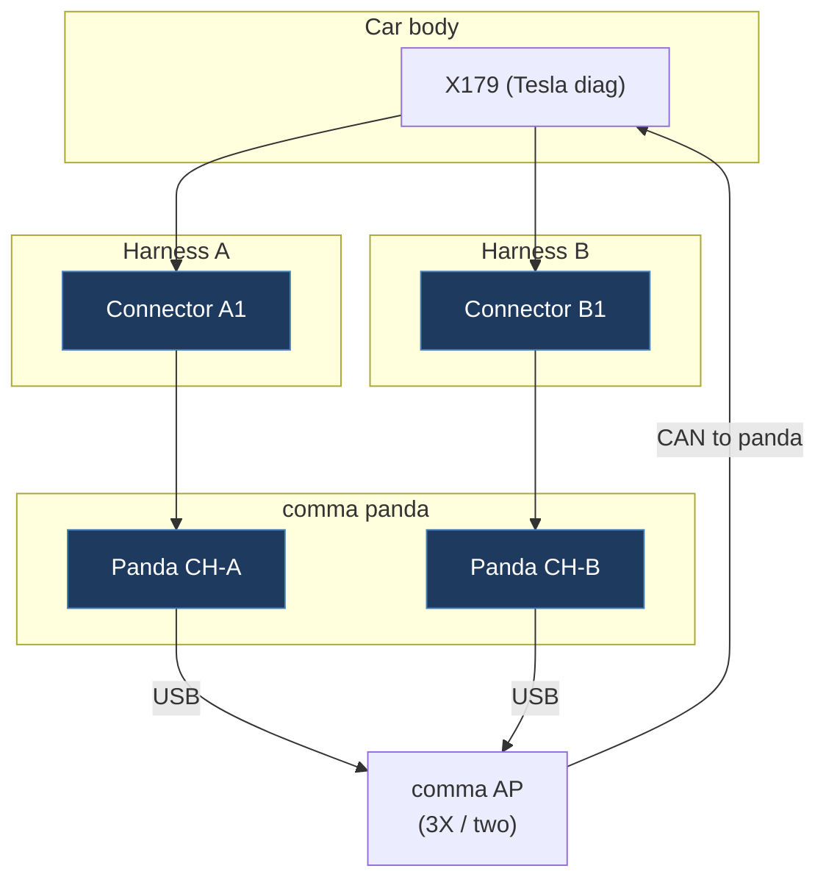

# openpilot Tesla Dual-Connector Harness Topology

> Sources: `legacy/commaai-openpilot` submodule + opendbc `opendbc/car/tesla/`
> Analysed: `values.py`, `carstate.py`, `carcontroller.py`, `teslacan.py`
> sunnypilot: `sunnypilot/opendbc` fork — `carcontroller.py`, `teslacan.py`, `carstate.py`, `coop_steering.py`



---

## 1. The Physical Setup

The **comma harness** (Tesla harness A / harness B) has **two vehicle-side connectors**:

```
         CAR BODY (X179 port)            AP COMPUTER port
                │                               │
     ┌──────────┴───────────────────────────────┴──────────┐
     │                  comma panda                        │
     │   CAN0 (party bus — car side)                       │
     │   CAN1 (vehicle CAN)                                │
     │   CAN2 (party bus — AP computer side)               │
     └──────────────────────────────────────────────────────┘
                              │
                        USB / USB-C
                              │
                      comma device (phone/C3)
                      running openpilot
```

- **Connector A** plugs into the car's **X179 OBD2-style port** (under the driver's seat).
- **Connector B** plugs inline at the **Autopilot computer's harness** (behind the dash / trunk area depending on model year).
- The panda hardware sits **in series** between the car body and the AP computer on the party CAN, and **passively bridges** the vehicle CAN.

---

## 2. Bus Numbering

### opendbc (`values.py`)

```python
class CANBUS:
    party          = 0   # X179 side — car body → panda
    vehicle        = 1   # Vehicle CAN (same as X179 pins 9-10)
    autopilot_party = 2  # AP computer side — panda → AP computer
```

### Our firmware (`ids.h` / `platformio.ini`)

| Our constant  | Bus # | Maps to openpilot | X179 pins | Description           |
| ------------- | ----- | ----------------- | --------- | --------------------- |
| `BUS_CHASSIS` | 0     | `CANBUS.party`    | 13-14     | Party / Autopilot CAN |
| `BUS_VEHICLE` | 1     | `CANBUS.vehicle`  | 9-10      | Vehicle Control CAN   |
| `BUS_BODY`    | 2     | **no equivalent** | 2-3       | Body CAN              |

> **Important**: The bus index numbers are a coincidence. openpilot's `CANBUS.autopilot_party = 2`
> is a **separate CAN transceiver inside the comma panda** connected at the AP computer's own
> harness plug (behind the dash/trunk). It is NOT the same as our `BUS_BODY` at X179 pins 2-3,
> which is the body CAN — an entirely different physical bus. They do not carry the same frames.

---

## 3. What openpilot Reads on Each Bus

### `Bus.party` (bus 0) — car body side, X179 plug

| Frame name         | CAN ID | Content                                                      |
| ------------------ | ------ | ------------------------------------------------------------ |
| `DI_speed`         | 0x257  | Vehicle speed (kph)                                          |
| `DI_systemStatus`  | 0x118  | Gear, accel pedal, DI state                                  |
| `DI_state`         | 0x118  | Cruise state, speed units, autopark                          |
| `ESP_status`       | ~      | Driver brake apply                                           |
| `ESP_B`            | ~      | Vehicle standstill                                           |
| `EPAS3S_sysStatus` | ~      | Steering angle (SAS), EPS hands-on level, torque, EAC status |
| `UI_warning`       | ~      | Doors, blinkers, seatbelt                                    |

### `Bus.autopilot_party` (bus 2) — AP computer's port

| Frame name                 | CAN ID | Content                                      |
| -------------------------- | ------ | -------------------------------------------- |
| `DAS_status`               | 0x389  | Blind spot left/right                        |
| `DAS_control`              | 0x2B9  | AEB event, accel limits, set speed           |
| `DAS_steeringControl`      | 0x488  | Stock LKAS/FSD steering control type         |
| `DAS_settings`             | 0x331  | `DAS_autosteerEnabled` flag                  |
| `SCCM_steeringAngleSensor` | ~      | Steering angle rate (comes from AP computer) |

> openpilot reads the AP computer's outgoing frames on bus 2 to detect when stock
> Autosteer/FSD is active (`invalidLkasSetting` logic) and to read the counter for
> cancellation (`das_control["DAS_controlCounter"]`).

---

## 4. What openpilot Injects

All injection is onto **`CANBUS.party` (bus 0)** — the car-body side. Because panda
sits between the car and the AP computer, frames sent on bus 0 are seen by the AP
computer as if they came from the car.

| Frame                 | CAN ID  | Rate  | Purpose                                          |
| --------------------- | ------- | ----- | ------------------------------------------------ |
| `DAS_steeringControl` | `0x488` | 50 Hz | Replace AP computer's steering command           |
| `APS_eacMonitor`      | `0x27D` | 5 Hz  | Keep EPS in EAC-allowed state                    |
| `DAS_control`         | `0x2B9` | 25 Hz | Longitudinal: acc state, accel limits, set speed |

**Frame construction (teslacan.py)**:

```python
# Steering
packer.make_can_msg("DAS_steeringControl", CANBUS.party, {
    "DAS_steeringAngleRequest": -angle,      # note: sign flip
    "DAS_steeringHapticRequest": 0,
    "DAS_steeringControlType": 1 or 2,       # ANGLE_CONTROL or LANE_KEEP_ASSIST
})

# Longitudinal
packer.make_can_msg("DAS_control", CANBUS.party, {
    "DAS_setSpeed":  min(max(v_ego + accel, 0) * MS_TO_KPH, 400),
    "DAS_accState":  4,           # ACC_ON  (13 = ACC_CANCEL_GENERIC_SILENT)
    "DAS_aebEvent":  0,
    "DAS_jerkMin":  -4.9,
    "DAS_jerkMax":   4.9,
    "DAS_accelMin":  accel,
    "DAS_accelMax":  max(accel, 0),
    "DAS_controlCounter": counter % 8,
})

# EPS keep-alive
packer.make_can_msg("APS_eacMonitor", CANBUS.party, {
    "APS_eacAllow": 1,
})
```

---

## 5. Controller Parameters (matches our firmware)

From `values.py / CarControllerParams`:

| Parameter        | openpilot value               | Our firmware constant                                     |
| ---------------- | ----------------------------- | --------------------------------------------------------- |
| `ACCEL_MAX`      | `2.0 m/s²`                    | `DAS_ACCEL_MAX_MS2 = 2.0f`                                |
| `ACCEL_MIN`      | `-3.48 m/s²`                  | `DAS_ACCEL_MIN_MS2 = -3.48f`                              |
| `JERK_LIMIT_MAX` | `4.9 m/s³`                    | `DAS_JERK_MAX_MS3 = 4.9f` — encoded in every DAS_control  |
| `JERK_LIMIT_MIN` | `-4.9 m/s³`                   | `DAS_JERK_MIN_MS3 = -4.9f` — encoded in every DAS_control |
| Steer step       | 50 Hz (every 2 frames @100Hz) | 50 Hz                                                     |
| EAC keep-alive   | 5 Hz (every 10 frames @50Hz)  | 5 Hz (every 10 of DAS_STEER_HZ)                           |

---

## 6. How Our ESP32 Mod Differs

The ESP32 mod connects **only at the X179 port** — it does NOT sit between the car and
the AP computer. This means:

| Capability                | comma panda            | Our ESP32                    |
| ------------------------- | ---------------------- | ---------------------------- |
| Read party CAN (car side) | ✅ bus 0               | ✅ BUS_CHASSIS=0             |
| Read vehicle CAN          | ✅ bus 1               | ✅ BUS_VEHICLE=1             |
| Read AP computer output   | ✅ bus 2 (dedicated)   | ✅ BUS_CHASSIS=0 (same wire) |
| Inject on party CAN       | ✅ bus 0               | ✅ BUS_CHASSIS=0             |
| Block AP computer frames  | ✅ (in-series harness) | ❌ (passive tap)             |

The party CAN is a single shared broadcast bus. The AP computer is just another node
on it. Our ESP32 tap at X179 sits on the same wire, so AP computer frames
(`DAS_control` 0x2B9, `DAS_steeringControl` 0x488, `DAS_status` 0x389, etc.)
arrive on BUS_CHASSIS=0 without any special setup — no comma harness needed.

The comma panda gets a **dedicated view** via its AP-side transceiver (bus 2) precisely
because it sits in-series and can isolate the two segments. That isolation is what
lets it **block** AP frames — something our passive tap cannot do.

### Consequence for injection

Because we are a **passive tap** (not in-series), when both our ESP32 and the AP
computer inject `DAS_control` / `DAS_steeringControl`, there is a **CAN bus
conflict**. The AP computer must have Autosteer/TACC **disabled** for our
injection frames to be the only ones on the bus. If both transmit simultaneously,
arbitration determines the winner (lower CAN ID wins, but both use same ID →
corruption / error frames).

**Mitigation already in our firmware**:

- `isFSDSelectedInUI()` / `readFollowDistance()` check whether Tesla's own TACC/FSD
  is active on the UI. Drive mode is gated on the car being in a state where the
  AP computer is not injecting.

---

## 7. Harness Variants

| Variant   | Hardware | Car connector     | AP connector                         |
| --------- | -------- | ----------------- | ------------------------------------ |
| `tesla_a` | HW3      | X179 (under seat) | AP compute box (trunk / behind dash) |
| `tesla_b` | HW4      | X179 (under seat) | AP compute box (HW4 location)        |

HW4 uses the same bus numbering and frame layout — only the fingerprinting (EPS FW)
and some frame signal names differ (FSD 14 flips `DAS_steeringControlType` 1↔2).

---

## 8. Key Takeaways for Firmware Development

1. **Same bus 0 = same party CAN** — openpilot's injection frames (IDs `0x488`,
   `0x2B9`, `0x27D`) are exactly what our firmware injects. The DBC signals map
   directly.

2. **Counter on `DAS_control`** must increment (`% 8`) — Tesla's AP computer
   validates this. openpilot reads the AP computer's last counter value on bus 2
   to ensure continuity on cancel. Our firmware ignores the AP computer
   entirely and increments its own counter from boot — the system is built
   for solo gamepad control, not co-existence with an AP computer.

3. **Sign flip on steering angle** — openpilot applies `-angle` when packing
   `DAS_steeringAngleRequest`. Verify our firmware matches this convention.

4. **`DAS_setSpeed` is computed from accel + vEgo** — openpilot does:
   `set_speed = clip(v_ego + accel, 0, ...) * MS_TO_KPH`. Our firmware uses
   `dasSpeedLimitKph` as the commanded set-speed, which is simpler but less
   dynamic.

5. **FSD 14 detection** — on FSD 14+ firmware (`DAS_steeringControlType` signal
   is flipped 1↔2). We should guard injection against these versions if needed.

---

## 9. AP Computer Co-existence — Removed

Earlier revisions of this firmware passively sniffed `DAS_control` (`0x2B9`) and
`DAS_steeringControl` (`0x488`) on `BUS_CHASSIS=0` to detect when the Tesla AP
computer was injecting and gate our own injection accordingly (modes
`YIELD` / `COPILOT` / `OVERRIDE`).

**That feature has been deleted.** The firmware is now built around solo
gamepad control: when DAS Drive is armed we are the sole authority on the
chassis bus. The AP computer is expected to be physically removed or simply
unused.

If you need the old AP-aware co-existence logic, see git history before this
change.

---

## 10. sunnypilot vs openpilot — Tesla Implementation Comparison

sunnypilot is a fork of openpilot. Its Tesla car code lives in `sunnypilot/opendbc`
(a fork of `commaai/opendbc`). Key differences found in `opendbc/car/tesla/`:

### Frame Construction (`teslacan.py`)

Both are **identical** for the core Tesla DAS frames:

| Aspect                     | openpilot                            | sunnypilot           |
| -------------------------- | ------------------------------------ | -------------------- |
| `DAS_control` rate         | 25 Hz (frame % 4)                    | 25 Hz (frame % 4)    |
| `DAS_steeringControl` rate | 50 Hz (frame % 2)                    | 50 Hz (frame % 2)    |
| `APS_eacMonitor` rate      | 10 Hz (frame % 10)                   | 10 Hz (frame % 10)   |
| `DAS_setSpeed` formula     | `clip(v_ego + accel, 0) * MS_TO_KPH` | identical            |
| `DAS_accelMin/Max`         | `accel`, `max(accel, 0)`             | identical            |
| Jerk limits                | `±4.9 m/s³`                          | identical            |
| Counter                    | `(frame // 4) % 8`                   | identical            |
| Sign flip on steer angle   | `-angle`                             | `-angle` (identical) |

### Cooperative Steering — sunnypilot Exclusive Feature

sunnypilot adds a **`CoopSteeringCarController`** mixin (`coop_steering.py`):

```python
# control_type selection (via TeslaFlagsSP.COOP_STEERING toggle):
control_type = 2   # LANE_KEEP_ASSIST  ← coop steering ON (allows driver override)
control_type = 1   # ANGLE_CONTROL     ← standard (snap-back on driver input)
```

The user can toggle this via a sunnypilot settings flag. LANE_KEEP_ASSIST (type 2) on
non-FSD14 firmware uses the stock LKAS disengagement logic which allows a smooth
driver wind-down without hard snap-back. On FSD14+ the types are swapped via
`get_steer_ctrl_type()` — so the effective wire values are reversed.

**Our firmware** always uses `DAS_STEER_ANGLE_CTRL = 1`. To support the coop-steering
mode we would need to add a runtime toggle and use `DAS_STEER_LKA = 2` instead.

### carstate.py Additions in sunnypilot

sunnypilot extends `CarState` with `CarStateExt` (from `carstate_ext.py`), adding:

- Extra cruise control buttons / gap adjust tracking
- `stockLkas` detection via `DAS_steeringControlType` (same logic as upstream, but
  also checked for FSD14 inference)
- `ret.steeringDisengage` = hands-on level ≥ 3 **or** high angle rate EAC fault

### Summary

For our ESP32 firmware purposes, the wire-level DAS frame format is **identical**
between openpilot and sunnypilot. The differences are higher-level (UX toggles,
coop-steering mode selection, FSD14 flag detection). No changes to our firmware
constants or frame encoding are needed to be compatible with either system.
